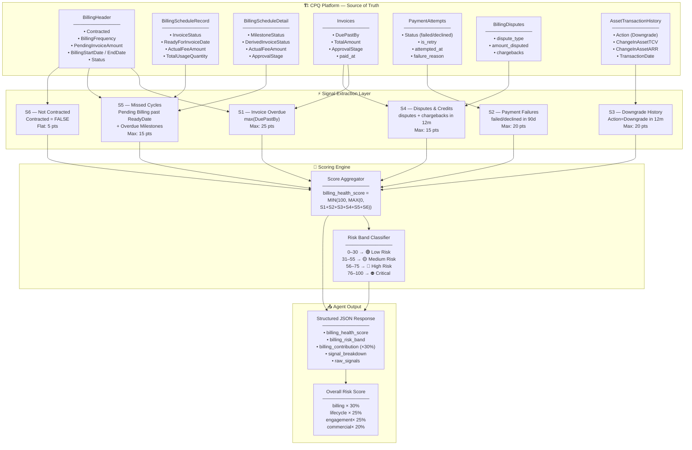
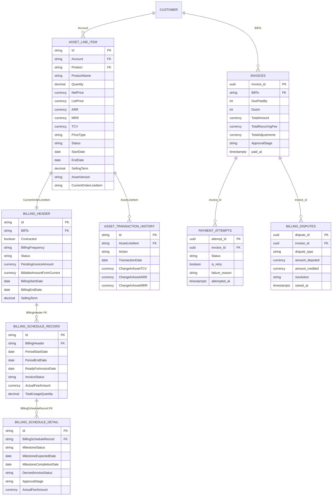
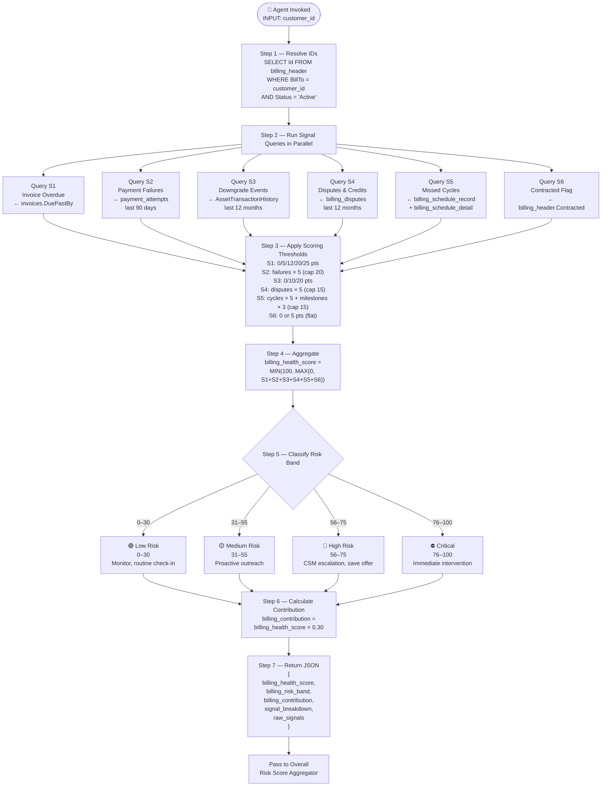
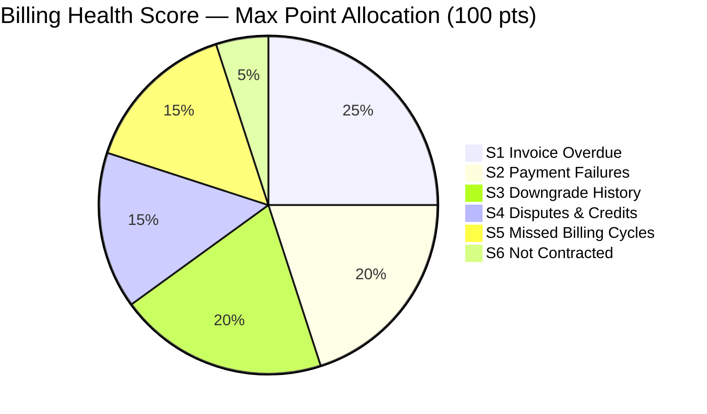
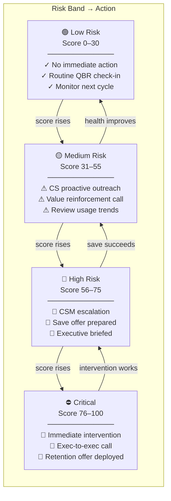

# Billing & Financial Signals — Technical Architecture
## Agent Reference Document for Renewal Risk Scoring

---

## 1. Purpose

This document defines the **Billing & Financial Signals** component of the Renewal Risk Scoring model.
An AI Agent must read this document to:
1. Understand which platform objects to query
2. Extract the correct signal fields
3. Compute sub-scores per signal
4. Aggregate into a final `billing_health_score` (0–100)
5. Map the score to a risk band and recommended action

The `billing_health_score` contributes **30%** of the overall Renewal Risk Score.

```
Overall Risk Score =
    (billing_health_score   × 30%) +
    (subscription_age_score × 25%) +
    (engagement_score       × 25%) +
    (commercial_fit_score   × 20%)
```

---

## 2. Platform Object Hierarchy

The Agent must traverse the following four-level platform object hierarchy:

```
billing_header                   (Level 1 — billing configuration per asset)
    └── billing_schedule_record  (Level 2 — one record per billing cycle)
            └── billing_schedule_detail  (Level 3 — fee line items per cycle)
                        └── invoices     (Level 4 — actual invoice sent to customer)
```

### Supporting Objects

```
invoices  ──< payment_attempts          (payment attempt log per invoice)
invoices  ──< billing_disputes          (disputes and credit notes per invoice)
AssetTransactionHistory                 (upgrade/downgrade event log per asset)
```

---

## 2a. Architectural View

### 2a.1 — End-to-End System Architecture



---

### 2a.2 — Platform Object Relationship Map



---

### 2a.3 — Agent Execution Flow



---

### 2a.4 — Signal Contribution Breakdown (Visual Weight)



---

### 2a.5 — Risk Escalation Matrix



---

## 3. Platform Object Definitions

### 3.0 AssetLineItem
**Purpose:** Root commercial record representing a single product the customer actively owns. All billing objects, transaction history, and scoring queries anchor to this object. Every customer can have multiple AssetLineItems (one per product/SKU).
**Platform Name:** `AssetLineItem`
**Relationship:** Many AssetLineItems → One Customer (Account); 1:1 with BillingHeader; 1:Many with AssetTransactionHistory

| Field | Data Type | Description | Churn Signal |
|---|---|---|---|
| `Id` | Identifier | Primary key | Join key — used in all billing & ATH queries |
| `Account` | Lookup | Customer account FK | Customer link |
| `Product` | Lookup | Product FK (links to price book) | Product context |
| `ProductName` | String | Name of the product owned | Display / segmentation |
| `Quantity` | Decimal | Number of units/seats on this asset | Volume baseline |
| `NetPrice` | Currency | Price per unit after applied discounts | **Discount signal** |
| `ListPrice` | Currency | Catalog list price per unit | Discount baseline |
| `ARR` | Currency | Annual Recurring Revenue for this asset | **Revenue at risk** |
| `MRR` | Currency | Monthly Recurring Revenue for this asset | MRR baseline |
| `TCV` | Currency | Total Contract Value | Contract exposure |
| `PriceType` | Picklist | Recurring / One-Time / Usage | Billing classification |
| `Status` | Picklist | **Active** / Inactive / Cancelled | Filter to active only |
| `StartDate` | Date | Asset commercial start date | Tenure signal |
| `EndDate` | Date | Asset commercial end date | **Renewal proximity** |
| `SellingTerm` | Decimal | Contract term in months | Commitment strength |
| `AssetVersion` | String | Amendment version identifier | Change frequency signal |
| `CurrentOrderLineItem` | Lookup | The order line that last amended this asset | Links to BillingHeader |

**Key query — resolve AssetLineItem for a customer:**
```sql
SELECT Id, ProductName, ARR, MRR, TCV, NetPrice, ListPrice,
       Quantity, Status, StartDate, EndDate, SellingTerm
FROM AssetLineItem
WHERE Account = :customer_id
  AND Status = 'Active';
```

---

### 3.1 BillingHeader
**Purpose:** Root billing configuration record — defines HOW an asset is billed.
**Platform Name:** `BillingHeader`
**Relationship:** 1:1 with Asset / Subscription

| Field | Data Type | Description | Churn Signal |
|---|---|---|---|
| `Id` | Identifier | Primary key | Join key |
| `BillTo` | Lookup | Customer account FK | Customer link |
| `Status` | Picklist | Active / Inactive billing status | Inactive = risk |
| `Contracted` | Boolean | Whether asset is formally contracted | `FALSE` = high risk |
| `BillingStartDate` | DateTime | Start of billing period | Tenure signal |
| `BillingEndDate` | DateTime | End of current billing period | Renewal proximity |
| `BillingFrequency` | Picklist | None / Monthly / Quarterly / Annual | `None` = broken billing |
| `BillingRule` | Picklist | Bill In Advance / Bill In Arrears | Exposure window |
| `BillingPreference` | Lookup | Customer billing policy override | Policy deviation |
| `PriceType` | Picklist | Recurring / One-Time / Usage | Billing type |
| `Quantity` | Decimal | Quantity units of product | Volume baseline |
| `NetUnitPrice` | Currency | Net unit price | Price baseline |
| `SellingTerm` | Decimal | Contract term length | Commitment signal |
| `BillableAmountFromCurrent` | Currency | Current period billable amount | Amount consistency |
| `PendingInvoiceAmount` | Currency | Total unbilled/pending amount | **High = billing stuck** |
| `Currency` | String | Currency code | — |
| `CurrentOrderLineItem` | Lookup | Active order line driving billing | Asset link |
| `CurrentOrderNumber` | Lookup | Associated order | Order link |
| `ProductName` | LongString | Name of the product being billed | Product context |
| `ProratingComputationMethod` | Picklist | Proration calculation method | — |
| `Message` | LongString | System out-of-box message | Error indicator |

---

### 3.2 BillingScheduleRecord (BSR)
**Purpose:** Individual billing cycle record — one per period.
**Platform Name:** `BillingScheduleRecord`
**Relationship:** Many BSR → One BillingHeader

| Field | Data Type | Description | Churn Signal |
|---|---|---|---|
| `Id` | Identifier | Primary key | Join key |
| `BillingHeader` | Lookup | Parent BillingHeader FK | Parent link |
| `BSRNumber` | AutoNumber | System sequence number | — |
| `PeriodStartDate` | DateTime | Start of billing cycle | Cycle timing |
| `PeriodEndDate` | DateTime | End of billing cycle | Cycle timing |
| `ReadyForInvoiceDate` | DateTime | Date invoice should be generated | **Key missed cycle signal** |
| `ActualFeeAmount` | Currency | Fee amount to be billed this cycle | Amount trend |
| `TotalUsageQuantity` | Decimal | Usage consumed this period | Usage drop = churn signal |
| `InvoiceStatus` | Picklist | Pending Billing / Invoiced / Cancelled | **Pending past due = missed** |
| `PaymentTerm` | Lookup | Payment terms for this cycle | — |
| `BillingDayOfMonth` | Int | Day of month billing triggers | — |
| `Currency` | String | Currency code | — |
| `BillReasonCode` | Picklist | System billing reason code | — |

**Missed Cycle Detection:**
```
InvoiceStatus = 'Pending Billing'
AND ReadyForInvoiceDate < CURRENT_DATE
```

---

### 3.3 BillingScheduleDetail (BSD)
**Purpose:** Fee line items within a billing cycle.
**Platform Name:** `BillingScheduleDetail`
**Relationship:** Many BSD → One BillingScheduleRecord

| Field | Data Type | Description | Churn Signal |
|---|---|---|---|
| `Id` | Identifier | Primary key | Join key |
| `BillingScheduleRecord` | Lookup | Parent BSR FK | Parent link |
| `BSDNumber` | AutoNumber | System sequence number | — |
| `PlanLineItem` | Lookup | Product/plan line item | Product link |
| `Category` | Picklist | Fee / Usage / Milestone | Billing type |
| `PeriodStartDate` | Date | Start of fee period | — |
| `PeriodEndDate` | Date | End of fee period | — |
| `ActualFeeAmount` | Currency | Billable amount for this line | — |
| `Percent` | Decimal | Percentage-based billing share | — |
| `ApprovalStage` | Picklist | Draft / Approved | Stuck draft = risk |
| `DerivedInvoiceStatus` | Picklist | Derived invoice status | — |
| `MilestoneExpectedDate` | Date | Planned milestone completion date | — |
| `MilestoneCompletionDate` | Date | Actual milestone completion date | — |
| `MilestoneStatus` | Picklist | Expected / Complete / **Overdue** | **Overdue = dissatisfaction** |
| `MilestonePercent` | Decimal | % of total billed at this milestone | — |
| `Currency` | String | Currency code | — |

---

### 3.4 Invoices
**Platform Name:** `invoices`
**Relationship:** Many Invoices → One BillingHeader (via BillTo)

| Field | Data Type | Description | Churn Signal |
|---|---|---|---|
| `invoice_id` | UUID | Primary key | Join key |
| `BillTo` | Lookup | Customer account FK | Customer link |
| `subscription_id` | UUID | Subscription FK | Subscription link |
| `invoice_number` / `Name` | String | Invoice number | — |
| `InvoiceDate` | DateTime | Date invoice was issued | — |
| `DueDate` | DateTime | Payment due date | Overdue baseline |
| `DuePastBy` | Int | **Days past due date** | **Direct overdue signal** |
| `DueIn` | Int | Days until due (negative if overdue) | Pre-due alert |
| `TotalAmount` | Currency | Final amount due | Amount baseline |
| `TotalRecurringFee` | Currency | Recurring fee component | Recurring health |
| `TotalOneTimeFee` | Currency | One-time fee component | — |
| `TotalUsageFee` | Currency | Usage fee component | Usage trend |
| `TotalAdjustments` | Currency | Total adjustments applied | Discount pressure |
| `SubTotal` | Currency | Pre-tax subtotal | — |
| `Tax` | Currency | Tax amount | — |
| `ApprovalStage` | Picklist | Draft / Approved / Cancelled | Stuck = risk |
| `PaymentTerm` | Lookup | Payment terms | — |
| `Currency` | String | Currency code | — |
| `paid_at` | TIMESTAMPTZ | Timestamp of payment | NULL = unpaid |

---

### 3.5 PaymentAttempts
**Platform Name:** `payment_attempts`
**Relationship:** Many PaymentAttempts → One Invoice

| Field | Data Type | Description | Churn Signal |
|---|---|---|---|
| `attempt_id` | UUID | Primary key | Join key |
| `invoice_id` | UUID | Invoice FK | Invoice link |
| `business_object_id` | String | Polymorphic FK (Invoice / ProductConfiguration) | — |
| `business_object_type` | Picklist | Type of linked business object | — |
| `PaymentId` | String | Gateway transaction ID | — |
| `Status` | Picklist | **success / failed / declined / retry** | **Failed = risk signal** |
| `Amount` | Currency | Payment amount attempted | — |
| `Currency` | String | Currency code | — |
| `payment_method_type` | Picklist | card / ach / wire / check | Method risk |
| `failure_reason` | String | Reason for failure | — |
| `is_retry` | Boolean | Whether this is a retry attempt | Multiple retries = risk |
| `attempted_at` | TIMESTAMPTZ | Timestamp of attempt | Recency filter |

---

### 3.6 BillingDisputes
**Platform Name:** `billing_disputes`
**Relationship:** Many Disputes → One Invoice

| Field | Data Type | Description | Churn Signal |
|---|---|---|---|
| `dispute_id` | UUID | Primary key | Join key |
| `invoice_id` | UUID | Invoice FK | Invoice link |
| `customer_id` | UUID | Customer FK | Customer link |
| `dispute_type` | Picklist | **dispute / credit_note / chargeback** | Type severity |
| `raised_at` | TIMESTAMPTZ | When dispute was raised | Recency filter |
| `resolved_at` | TIMESTAMPTZ | When resolved (NULL = open) | Open = active risk |
| `amount_disputed` | Currency | Amount under dispute | Financial exposure |
| `amount_credited` | Currency | Amount credited back | — |
| `resolution` | Picklist | upheld / rejected / partial / pending | Outcome |
| `notes` | Text | Internal notes | — |

---

### 3.7 AssetTransactionHistory
**Platform Name:** `AssetTransactionHistory`
**Relationship:** Many Transactions → One AssetLineItem

| Field | Data Type | Description | Churn Signal |
|---|---|---|---|
| `Id` | Identifier | Primary key | Join key |
| `AssetLineItem` | Lookup | Asset being transacted | Asset link |
| `ToAssetLineItem` | Lookup | Asset changed to (post-change) | New tier |
| `Action` | Picklist | **Upgrade / Downgrade** / Renewal / Cancel | **Downgrade = risk** |
| `TransactionDate` | Date | Date of transaction | Recency filter |
| `EffectiveStartDate` | Date | Commercial effective date | — |
| `ChangeInAssetARR` | Currency | Change in Annual Recurring Revenue | ARR delta |
| `ChangeInAssetMRR` | Currency | Change in Monthly Recurring Revenue | MRR delta |
| `ChangeInAssetTCV` | Currency | **Change in Total Contract Value** | **TCV drop = downgrade** |
| `ImpactARR` | Currency | Portfolio ARR impact | — |
| `ImpactMRR` | Currency | Portfolio MRR impact | — |
| `ImpactTCV` | Currency | Portfolio TCV impact | — |
| `Order` | Lookup | Amendment order | Order link |
| `OrderLineItem` | Lookup | Amendment order line item | Line link |
| `Currency` | String | Currency code | — |

---

## 4. The Five Billing Health Signals

### Signal 1 — Invoice Overdue
**Source:** `invoices.DuePastBy`
**Description:** Number of days the most recent invoice is past its due date.

| Threshold | Points Assigned |
|---|---|
| 0 or negative (paid on time / early) | 0 |
| 1–7 days late | 5 |
| 8–30 days late | 12 |
| 31–60 days late | 20 |
| 61+ days late | 25 |

**Max contribution:** 25 points
**Query:**
```sql
SELECT MAX(DuePastBy) AS max_days_overdue
FROM invoices
WHERE BillTo = :customer_id
  AND ApprovalStage != 'Cancelled'
ORDER BY DueDate DESC
LIMIT 1;
```

---

### Signal 2 — Payment Failures & Retries
**Source:** `payment_attempts.Status`, `payment_attempts.is_retry`
**Description:** Count of failed or declined payment attempts in the last 90 days.

| Threshold | Points Assigned |
|---|---|
| 0 failures | 0 |
| 1 failure | 5 |
| 2 failures | 10 |
| 3 failures | 15 |
| 4+ failures | 20 (capped) |

**Max contribution:** 20 points
**Query:**
```sql
SELECT
    COUNT(*) FILTER (WHERE pa.Status IN ('failed', 'declined'))
        AS payment_failures_90d,
    COUNT(*) FILTER (WHERE pa.is_retry = true)
        AS payment_retries_90d
FROM payment_attempts pa
JOIN invoices i ON i.invoice_id = pa.invoice_id
WHERE i.BillTo = :customer_id
  AND pa.attempted_at >= now() - INTERVAL '90 days';
```

---

### Signal 3 — Downgrade History
**Source:** `AssetTransactionHistory.Action`, `AssetTransactionHistory.ChangeInAssetTCV`
**Description:** Number of downgrade events and TCV lost in the last 12 months.

| Threshold | Points Assigned |
|---|---|
| 0 downgrades | 0 |
| 1 downgrade in 12 months | 10 |
| 2+ downgrades in 12 months | 20 |

**Max contribution:** 20 points
**Query:**
```sql
SELECT
    COUNT(*) FILTER (
        WHERE Action = 'Downgrade'
        AND TransactionDate >= now() - INTERVAL '12 months'
    ) AS downgrades_12m,
    SUM(ChangeInAssetTCV) FILTER (
        WHERE Action = 'Downgrade'
        AND TransactionDate >= now() - INTERVAL '12 months'
    ) AS tcv_lost_12m,
    SUM(ChangeInAssetARR) FILTER (
        WHERE Action = 'Downgrade'
        AND TransactionDate >= now() - INTERVAL '12 months'
    ) AS arr_lost_12m
FROM AssetTransactionHistory
WHERE AssetLineItem = :asset_line_item_id;
```

---

### Signal 4 — Disputed Invoices & Credit Notes
**Source:** `billing_disputes.dispute_type`, `billing_disputes.amount_disputed`
**Description:** Number of disputes, credit notes, or chargebacks raised in the last 12 months.

| Threshold | Points Assigned |
|---|---|
| 0 disputes | 0 |
| 1 dispute | 5 |
| 2 disputes | 10 |
| 3+ disputes | 15 (capped) |
| Any chargeback (regardless of count) | +5 bonus severity points |

**Max contribution:** 15 points (+ 5 chargeback severity = 20 absolute max, capped at 15)
**Query:**
```sql
SELECT
    COUNT(*) FILTER (
        WHERE raised_at >= now() - INTERVAL '12 months'
    ) AS disputes_12m,
    SUM(amount_disputed) FILTER (
        WHERE raised_at >= now() - INTERVAL '12 months'
    ) AS disputed_amount_12m,
    COUNT(*) FILTER (
        WHERE dispute_type = 'chargeback'
        AND raised_at >= now() - INTERVAL '12 months'
    ) AS chargebacks_12m
FROM billing_disputes
WHERE customer_id = :customer_id;
```

---

### Signal 5 — Missed & Stuck Billing Cycles
**Source:** `billing_schedule_record.InvoiceStatus`, `billing_schedule_record.ReadyForInvoiceDate`
**Secondary:** `billing_schedule_detail.MilestoneStatus`
**Description:** Billing cycles that are past their `ReadyForInvoiceDate` but still in `Pending Billing` status.

| Threshold | Points Assigned |
|---|---|
| 0 missed cycles | 0 |
| 1 missed cycle | 5 |
| 2 missed cycles | 10 |
| 3+ missed cycles | 15 (capped) |
| Any `MilestoneStatus = 'Overdue'` | +3 bonus per overdue milestone (max +6) |

**Max contribution:** 15 points
**Query:**
```sql
-- Missed billing cycles
SELECT
    COUNT(*) AS missed_cycles_total,
    MAX(CURRENT_DATE - ReadyForInvoiceDate::DATE) AS max_days_billing_stuck,
    SUM(ActualFeeAmount) AS stuck_billing_amount
FROM billing_schedule_record
WHERE BillingHeader = :billing_header_id
  AND InvoiceStatus = 'Pending Billing'
  AND ReadyForInvoiceDate < CURRENT_DATE;

-- Overdue milestones
SELECT COUNT(*) AS overdue_milestones
FROM billing_schedule_detail bsd
JOIN billing_schedule_record bsr ON bsr.Id = bsd.BillingScheduleRecord
WHERE bsr.BillingHeader = :billing_header_id
  AND bsd.MilestoneStatus = 'Overdue';
```

---

### Signal 6 — Non-Contracted Asset (Flat Penalty)
**Source:** `billing_header.Contracted`
**Description:** Assets without a formal contract have no commitment — highest churn probability.

| Condition | Points Assigned |
|---|---|
| `Contracted = TRUE` | 0 |
| `Contracted = FALSE` | 5 |

**Max contribution:** 5 points

---

## 5. Score Aggregation Formula

```
billing_health_score = LEAST(100, GREATEST(0,
    signal_1_invoice_overdue_pts        +   -- max 25
    signal_2_payment_failures_pts       +   -- max 20
    signal_3_downgrade_pts              +   -- max 20
    signal_4_disputes_pts               +   -- max 15
    signal_5_missed_cycles_pts          +   -- max 15
    signal_6_not_contracted_pts             -- max 5
))
```

**Total possible: 100 points**
Higher score = worse billing health = higher churn risk.

---

## 6. Scoring Pseudocode for Agent

```python
def compute_billing_health_score(billing_header_id: str, customer_id: str) -> dict:

    # --- Signal 1: Invoice overdue ---
    max_days_overdue = query_max_days_overdue(customer_id)
    if max_days_overdue <= 0:
        s1 = 0
    elif max_days_overdue <= 7:
        s1 = 5
    elif max_days_overdue <= 30:
        s1 = 12
    elif max_days_overdue <= 60:
        s1 = 20
    else:
        s1 = 25

    # --- Signal 2: Payment failures ---
    failures_90d = query_payment_failures(customer_id, days=90)
    s2 = min(20, failures_90d * 5)

    # --- Signal 3: Downgrades ---
    downgrades_12m = query_downgrades(billing_header_id, months=12)
    if downgrades_12m == 0:
        s3 = 0
    elif downgrades_12m == 1:
        s3 = 10
    else:
        s3 = 20

    # --- Signal 4: Disputes ---
    disputes_12m = query_disputes(customer_id, months=12)
    chargebacks_12m = query_chargebacks(customer_id, months=12)
    s4 = min(15, (disputes_12m * 5) + (chargebacks_12m * 5))

    # --- Signal 5: Missed cycles + overdue milestones ---
    missed_cycles = query_missed_cycles(billing_header_id)
    overdue_milestones = query_overdue_milestones(billing_header_id)
    s5 = min(15, (missed_cycles * 5) + (overdue_milestones * 3))

    # --- Signal 6: Not contracted ---
    contracted = query_contracted_flag(billing_header_id)
    s6 = 0 if contracted else 5

    # --- Final score ---
    raw_score = s1 + s2 + s3 + s4 + s5 + s6
    billing_health_score = max(0, min(100, raw_score))

    return {
        "billing_header_id": billing_header_id,
        "customer_id": customer_id,
        "billing_health_score": billing_health_score,
        "signal_breakdown": {
            "invoice_overdue_pts": s1,
            "payment_failures_pts": s2,
            "downgrade_pts": s3,
            "dispute_pts": s4,
            "missed_cycles_pts": s5,
            "not_contracted_pts": s6
        }
    }
```

---

## 7. Risk Band Mapping

| Billing Health Score | Risk Band | Color | Recommended Action |
|---|---|---|---|
| 0–30 | Low Risk | 🟢 | Monitor, routine check-in |
| 31–55 | Medium Risk | 🟡 | Proactive outreach, value reinforcement |
| 56–75 | High Risk | 🔴 | CSM escalation, save offer |
| 76–100 | Critical | ⛔ | Immediate intervention, exec involvement |

---

## 8. Full SQL View for Agent Execution

```sql
CREATE MATERIALIZED VIEW billing_health_signals AS
WITH

invoice_overdue AS (
    SELECT
        bh.Id                                                   AS billing_header_id,
        bh.BillTo                                               AS customer_id,
        MAX(i.DuePastBy)                                        AS max_days_overdue,
        COUNT(*) FILTER (WHERE i.DuePastBy > 0)                 AS overdue_invoice_count,
        COUNT(*) FILTER (
            WHERE i.DuePastBy > 0
            AND i.InvoiceDate >= now() - INTERVAL '12 months'
        )                                                       AS overdue_invoices_12m
    FROM billing_header bh
    LEFT JOIN invoices i ON i.BillTo = bh.BillTo
    GROUP BY bh.Id, bh.BillTo
),

payment_risk AS (
    SELECT
        i.BillTo                                                AS customer_id,
        COUNT(*) FILTER (
            WHERE pa.Status IN ('failed', 'declined')
            AND pa.attempted_at >= now() - INTERVAL '90 days'
        )                                                       AS payment_failures_90d,
        COUNT(*) FILTER (
            WHERE pa.is_retry = true
            AND pa.attempted_at >= now() - INTERVAL '90 days'
        )                                                       AS payment_retries_90d
    FROM payment_attempts pa
    JOIN invoices i ON i.invoice_id = pa.invoice_id
    GROUP BY i.BillTo
),

downgrade_risk AS (
    SELECT
        bh.Id                                                   AS billing_header_id,
        bh.BillTo                                               AS customer_id,
        COUNT(*) FILTER (
            WHERE ath.Action = 'Downgrade'
            AND ath.TransactionDate >= now() - INTERVAL '12 months'
        )                                                       AS downgrades_12m,
        SUM(ath.ChangeInAssetTCV) FILTER (
            WHERE ath.Action = 'Downgrade'
            AND ath.TransactionDate >= now() - INTERVAL '12 months'
        )                                                       AS tcv_lost_12m,
        SUM(ath.ChangeInAssetARR) FILTER (
            WHERE ath.Action = 'Downgrade'
            AND ath.TransactionDate >= now() - INTERVAL '12 months'
        )                                                       AS arr_lost_12m
    FROM billing_header bh
    LEFT JOIN AssetTransactionHistory ath
           ON ath.AssetLineItem = bh.CurrentOrderLineItem
    GROUP BY bh.Id, bh.BillTo
),

dispute_risk AS (
    SELECT
        i.BillTo                                                AS customer_id,
        COUNT(bd.dispute_id) FILTER (
            WHERE bd.raised_at >= now() - INTERVAL '12 months'
        )                                                       AS disputes_12m,
        SUM(bd.amount_disputed) FILTER (
            WHERE bd.raised_at >= now() - INTERVAL '12 months'
        )                                                       AS disputed_amount_12m,
        COUNT(bd.dispute_id) FILTER (
            WHERE bd.dispute_type = 'chargeback'
            AND bd.raised_at >= now() - INTERVAL '12 months'
        )                                                       AS chargebacks_12m
    FROM billing_disputes bd
    JOIN invoices i ON i.invoice_id = bd.invoice_id
    GROUP BY i.BillTo
),

missed_cycles AS (
    SELECT
        bsr.BillingHeader                                       AS billing_header_id,
        COUNT(*) FILTER (
            WHERE bsr.InvoiceStatus = 'Pending Billing'
            AND bsr.ReadyForInvoiceDate < CURRENT_DATE
        )                                                       AS missed_cycles_total,
        MAX(CURRENT_DATE - bsr.ReadyForInvoiceDate::DATE) FILTER (
            WHERE bsr.InvoiceStatus = 'Pending Billing'
            AND bsr.ReadyForInvoiceDate < CURRENT_DATE
        )                                                       AS max_days_billing_stuck,
        SUM(bsr.ActualFeeAmount) FILTER (
            WHERE bsr.InvoiceStatus = 'Pending Billing'
            AND bsr.ReadyForInvoiceDate < CURRENT_DATE
        )                                                       AS stuck_billing_amount
    FROM billing_schedule_record bsr
    GROUP BY bsr.BillingHeader
),

milestone_risk AS (
    SELECT
        bsr.BillingHeader                                       AS billing_header_id,
        COUNT(*) FILTER (
            WHERE bsd.MilestoneStatus = 'Overdue'
        )                                                       AS overdue_milestones
    FROM billing_schedule_detail bsd
    JOIN billing_schedule_record bsr ON bsr.Id = bsd.BillingScheduleRecord
    GROUP BY bsr.BillingHeader
)

SELECT
    bh.Id                                                       AS billing_header_id,
    bh.BillTo                                                   AS customer_id,
    bh.ProductName,
    bh.BillingFrequency,
    bh.SellingTerm,
    bh.Contracted,
    bh.PendingInvoiceAmount,
    bh.BillableAmountFromCurrent,

    -- Raw signal values
    COALESCE(io.max_days_overdue, 0)                            AS max_days_overdue,
    COALESCE(io.overdue_invoice_count, 0)                       AS overdue_invoice_count,
    COALESCE(pr.payment_failures_90d, 0)                        AS payment_failures_90d,
    COALESCE(pr.payment_retries_90d, 0)                         AS payment_retries_90d,
    COALESCE(dr.downgrades_12m, 0)                              AS downgrades_12m,
    COALESCE(dr.tcv_lost_12m, 0)                                AS tcv_lost_12m,
    COALESCE(dr.arr_lost_12m, 0)                                AS arr_lost_12m,
    COALESCE(disp.disputes_12m, 0)                              AS disputes_12m,
    COALESCE(disp.disputed_amount_12m, 0)                       AS disputed_amount_12m,
    COALESCE(disp.chargebacks_12m, 0)                           AS chargebacks_12m,
    COALESCE(mc.missed_cycles_total, 0)                         AS missed_cycles_total,
    COALESCE(mc.max_days_billing_stuck, 0)                      AS max_days_billing_stuck,
    COALESCE(mc.stuck_billing_amount, 0)                        AS stuck_billing_amount,
    COALESCE(mr.overdue_milestones, 0)                          AS overdue_milestones,

    -- Individual signal scores
    CASE
        WHEN COALESCE(io.max_days_overdue, 0) <= 0  THEN 0
        WHEN io.max_days_overdue <= 7               THEN 5
        WHEN io.max_days_overdue <= 30              THEN 12
        WHEN io.max_days_overdue <= 60              THEN 20
        ELSE 25
    END                                                         AS s1_invoice_overdue_pts,

    LEAST(20, COALESCE(pr.payment_failures_90d, 0) * 5)        AS s2_payment_failure_pts,

    CASE
        WHEN COALESCE(dr.downgrades_12m, 0) = 0    THEN 0
        WHEN dr.downgrades_12m = 1                  THEN 10
        ELSE 20
    END                                                         AS s3_downgrade_pts,

    LEAST(15,
        COALESCE(disp.disputes_12m, 0) * 5 +
        COALESCE(disp.chargebacks_12m, 0) * 5
    )                                                           AS s4_dispute_pts,

    LEAST(15,
        COALESCE(mc.missed_cycles_total, 0) * 5 +
        COALESCE(mr.overdue_milestones, 0) * 3
    )                                                           AS s5_missed_cycle_pts,

    CASE WHEN bh.Contracted = FALSE THEN 5 ELSE 0 END          AS s6_not_contracted_pts,

    -- Final billing health score (0–100)
    LEAST(100, GREATEST(0,
        CASE
            WHEN COALESCE(io.max_days_overdue, 0) <= 0  THEN 0
            WHEN io.max_days_overdue <= 7               THEN 5
            WHEN io.max_days_overdue <= 30              THEN 12
            WHEN io.max_days_overdue <= 60              THEN 20
            ELSE 25
        END
        + LEAST(20, COALESCE(pr.payment_failures_90d, 0) * 5)
        + CASE
            WHEN COALESCE(dr.downgrades_12m, 0) = 0    THEN 0
            WHEN dr.downgrades_12m = 1                  THEN 10
            ELSE 20
          END
        + LEAST(15,
            COALESCE(disp.disputes_12m, 0) * 5 +
            COALESCE(disp.chargebacks_12m, 0) * 5
          )
        + LEAST(15,
            COALESCE(mc.missed_cycles_total, 0) * 5 +
            COALESCE(mr.overdue_milestones, 0) * 3
          )
        + CASE WHEN bh.Contracted = FALSE THEN 5 ELSE 0 END
    ))                                                          AS billing_health_score,

    -- Risk band
    CASE
        WHEN LEAST(100, GREATEST(0,
            CASE
                WHEN COALESCE(io.max_days_overdue, 0) <= 0  THEN 0
                WHEN io.max_days_overdue <= 7               THEN 5
                WHEN io.max_days_overdue <= 30              THEN 12
                WHEN io.max_days_overdue <= 60              THEN 20
                ELSE 25
            END
            + LEAST(20, COALESCE(pr.payment_failures_90d, 0) * 5)
            + CASE
                WHEN COALESCE(dr.downgrades_12m, 0) = 0    THEN 0
                WHEN dr.downgrades_12m = 1                  THEN 10
                ELSE 20
              END
            + LEAST(15,
                COALESCE(disp.disputes_12m, 0) * 5 +
                COALESCE(disp.chargebacks_12m, 0) * 5
              )
            + LEAST(15,
                COALESCE(mc.missed_cycles_total, 0) * 5 +
                COALESCE(mr.overdue_milestones, 0) * 3
              )
            + CASE WHEN bh.Contracted = FALSE THEN 5 ELSE 0 END
        )) BETWEEN 0  AND 30 THEN 'Low Risk'
        WHEN LEAST(100, GREATEST(0,
            CASE
                WHEN COALESCE(io.max_days_overdue, 0) <= 0  THEN 0
                WHEN io.max_days_overdue <= 7               THEN 5
                WHEN io.max_days_overdue <= 30              THEN 12
                WHEN io.max_days_overdue <= 60              THEN 20
                ELSE 25
            END
            + LEAST(20, COALESCE(pr.payment_failures_90d, 0) * 5)
            + CASE
                WHEN COALESCE(dr.downgrades_12m, 0) = 0    THEN 0
                WHEN dr.downgrades_12m = 1                  THEN 10
                ELSE 20
              END
            + LEAST(15,
                COALESCE(disp.disputes_12m, 0) * 5 +
                COALESCE(disp.chargebacks_12m, 0) * 5
              )
            + LEAST(15,
                COALESCE(mc.missed_cycles_total, 0) * 5 +
                COALESCE(mr.overdue_milestones, 0) * 3
              )
            + CASE WHEN bh.Contracted = FALSE THEN 5 ELSE 0 END
        )) BETWEEN 31 AND 55 THEN 'Medium Risk'
        WHEN LEAST(100, GREATEST(0,
            CASE
                WHEN COALESCE(io.max_days_overdue, 0) <= 0  THEN 0
                WHEN io.max_days_overdue <= 7               THEN 5
                WHEN io.max_days_overdue <= 30              THEN 12
                WHEN io.max_days_overdue <= 60              THEN 20
                ELSE 25
            END
            + LEAST(20, COALESCE(pr.payment_failures_90d, 0) * 5)
            + CASE
                WHEN COALESCE(dr.downgrades_12m, 0) = 0    THEN 0
                WHEN dr.downgrades_12m = 1                  THEN 10
                ELSE 20
              END
            + LEAST(15,
                COALESCE(disp.disputes_12m, 0) * 5 +
                COALESCE(disp.chargebacks_12m, 0) * 5
              )
            + LEAST(15,
                COALESCE(mc.missed_cycles_total, 0) * 5 +
                COALESCE(mr.overdue_milestones, 0) * 3
              )
            + CASE WHEN bh.Contracted = FALSE THEN 5 ELSE 0 END
        )) BETWEEN 56 AND 75 THEN 'High Risk'
        ELSE 'Critical'
    END                                                         AS billing_risk_band

FROM billing_header bh
LEFT JOIN invoice_overdue  io   ON io.billing_header_id  = bh.Id
LEFT JOIN payment_risk     pr   ON pr.customer_id        = bh.BillTo
LEFT JOIN downgrade_risk   dr   ON dr.billing_header_id  = bh.Id
LEFT JOIN dispute_risk     disp ON disp.customer_id      = bh.BillTo
LEFT JOIN missed_cycles    mc   ON mc.billing_header_id  = bh.Id
LEFT JOIN milestone_risk   mr   ON mr.billing_header_id  = bh.Id
WHERE bh.Status = 'Active';
```

---

## 9. Agent Execution Instructions

### Step 1 — Resolve the billing_header_id
```
INPUT:  customer_id OR asset_id OR subscription_id
QUERY:  SELECT Id FROM billing_header WHERE BillTo = :customer_id AND Status = 'Active'
OUTPUT: billing_header_id (one per active asset)
```

### Step 2 — Run each signal query
Execute the six signal queries in Section 4 using `billing_header_id` and `customer_id`.

### Step 3 — Compute individual signal points
Apply the scoring thresholds from Section 4 to each raw signal value.

### Step 4 — Sum and cap
```
billing_health_score = MIN(100, MAX(0, s1 + s2 + s3 + s4 + s5 + s6))
```

### Step 5 — Map to risk band (Section 7)

### Step 6 — Contribute to overall Risk Score
```
billing_contribution = billing_health_score × 0.30
```
Pass `billing_contribution` to the overall Risk Score aggregator along with the other three component scores.

### Step 7 — Return structured output
```json
{
  "billing_header_id": "BH-001",
  "customer_id": "CUST-001",
  "billing_health_score": 47,
  "billing_risk_band": "Medium Risk",
  "billing_contribution_to_overall": 14.1,
  "signal_breakdown": {
    "s1_invoice_overdue_pts": 12,
    "s2_payment_failure_pts": 10,
    "s3_downgrade_pts": 10,
    "s4_dispute_pts": 5,
    "s5_missed_cycle_pts": 5,
    "s6_not_contracted_pts": 5
  },
  "raw_signals": {
    "max_days_overdue": 14,
    "payment_failures_90d": 2,
    "downgrades_12m": 1,
    "tcv_lost_12m": -12000,
    "disputes_12m": 1,
    "missed_cycles_total": 1,
    "overdue_milestones": 0,
    "pending_invoice_amount": 5400,
    "contracted": false
  }
}
```

---

## 10. Weight Tuning Guide

The Agent supports weight overrides per persona. Pass these as configuration parameters:

| Persona | S1 Overdue | S2 Payments | S3 Downgrades | S4 Disputes | S5 Missed | S6 Contracted |
|---|---|---|---|---|---|---|
| CFO (default) | 25 | 20 | 20 | 15 | 15 | 5 |
| CS Team | 15 | 15 | 25 | 20 | 20 | 5 |
| Finance Ops | 30 | 25 | 15 | 15 | 10 | 5 |
| Sales | 20 | 15 | 30 | 15 | 10 | 10 |

All weights in each row must sum to 100.

---

*Document version: 1.0 | Last updated: 2026-05-26 | Owner: Revenue Architecture*
