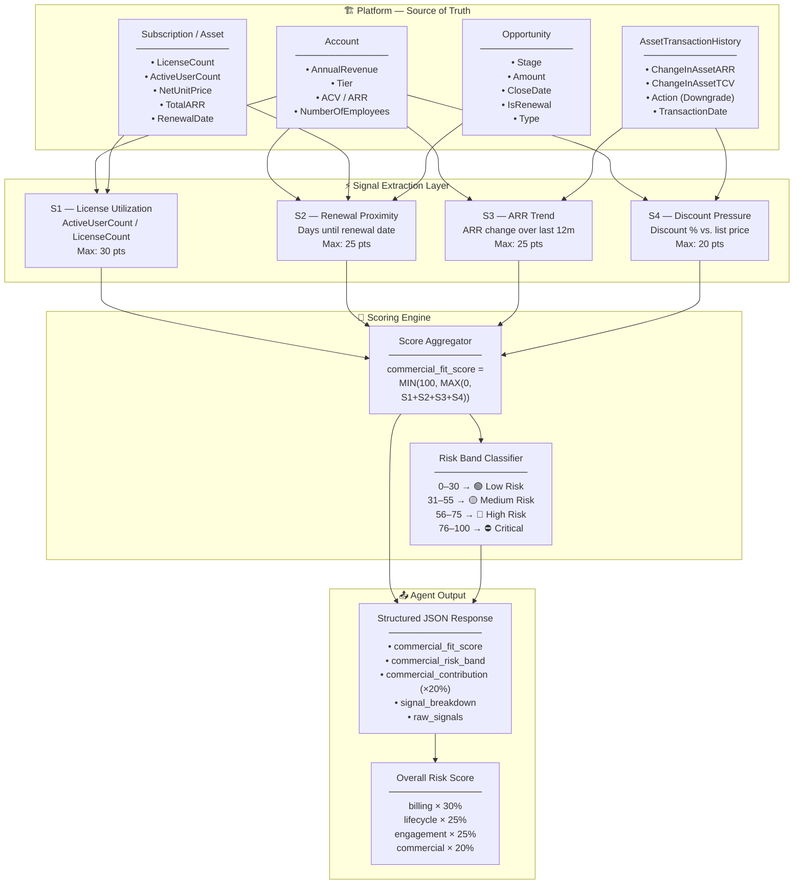
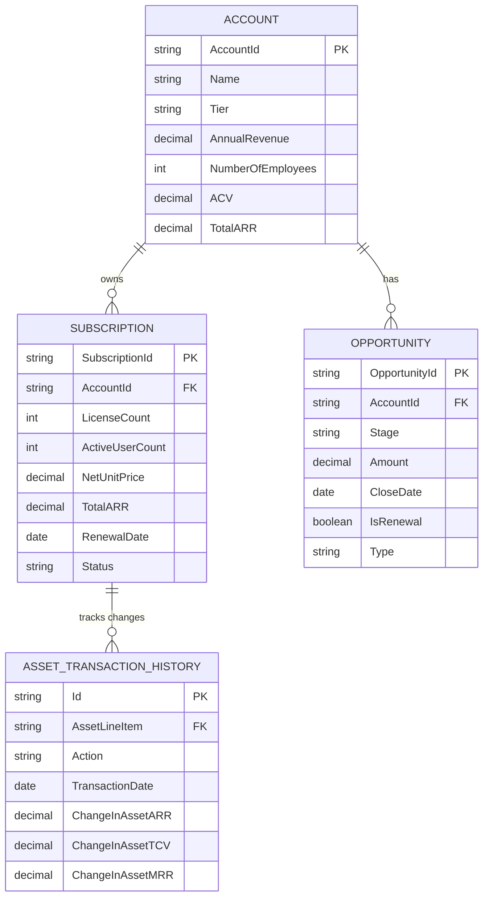
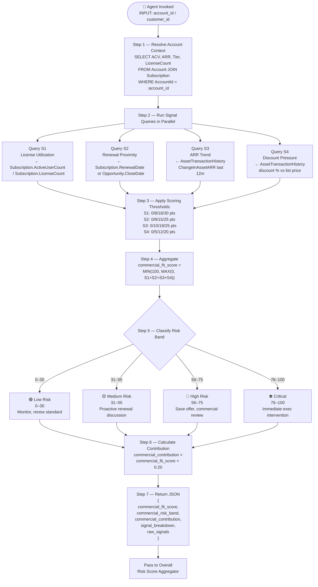
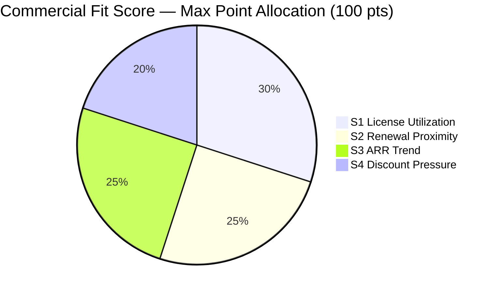
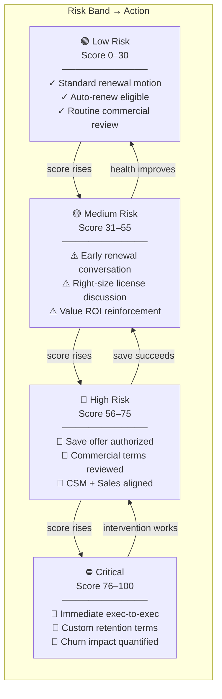

# Commercial Fit Signals — Technical Architecture
## Agent Reference Document for Renewal Risk Scoring

---

## 1. Purpose

This document defines the **Commercial Fit Signals** component of the Renewal Risk Scoring model.
An AI Agent must read this document to:
1. Understand which commercial and account objects to query
2. Extract the correct commercial health fields
3. Compute sub-scores per signal
4. Aggregate into a final `commercial_fit_score` (0–100)
5. Map the score to a risk band and recommended action

The `commercial_fit_score` contributes **20%** of the overall Renewal Risk Score.

```
Overall Risk Score =
    (billing_health_score         × 30%) +
    (subscription_lifecycle_score × 25%) +
    (engagement_score             × 25%) +
    (commercial_fit_score         × 20%)
```

---

## 2. Platform Object Hierarchy

The Agent must query the following objects:

```
Account / Customer                (Level 1 — ACV, ARR, tier context)
    ├── Subscription / Asset      (Level 2 — license count, utilization)
    ├── Opportunity               (Level 2 — renewal opportunity, stage)
    └── AssetTransactionHistory   (Level 2 — discount trend, ARR changes)
```

---

## 2a. Architectural View

### 2a.1 — End-to-End System Architecture



---

### 2a.2 — Platform Object Relationship Map



---

### 2a.3 — Agent Execution Flow



---

### 2a.4 — Signal Contribution Breakdown (Visual Weight)



---

### 2a.5 — Risk Escalation Matrix



---

## 3. Platform Object Definitions

### 3.1 Account / Customer
**Purpose:** Root commercial record — defines the account tier, ACV, and ARR baseline.

| Field | Data Type | Description | Churn Signal |
|---|---|---|---|
| `AccountId` | Identifier | Primary key | Join key |
| `Name` | String | Account name | Display |
| `Tier` | Picklist | Enterprise / Mid-Market / SMB | Tier-adjusted scoring |
| `AnnualRevenue` | Currency | Customer-reported annual revenue | ICP fit proxy |
| `ACV` | Currency | Annual Contract Value | Revenue at risk |
| `TotalARR` | Currency | Total Annual Recurring Revenue | Portfolio exposure |
| `NumberOfEmployees` | Integer | Employee count | ICP fit proxy |

---

### 3.2 Subscription / Asset
**Purpose:** Tracks the commercial subscription including license counts and renewal timing.

| Field | Data Type | Description | Churn Signal |
|---|---|---|---|
| `SubscriptionId` | Identifier | Primary key | Join key |
| `AccountId` | Lookup | Account FK | Parent link |
| `LicenseCount` | Integer | Total licenses purchased | Capacity baseline |
| `ActiveUserCount` | Integer | Currently active users | **Utilization signal** |
| `NetUnitPrice` | Currency | Price per unit after discount | Discount baseline |
| `TotalARR` | Currency | ARR for this subscription | Revenue baseline |
| `RenewalDate` | Date | Next renewal date | **Proximity signal** |
| `Status` | Picklist | Active / Pending / Churned | Filter to active |

---

### 3.3 Opportunity
**Purpose:** Tracks the renewal opportunity record in the CRM pipeline.

| Field | Data Type | Description | Churn Signal |
|---|---|---|---|
| `OpportunityId` | Identifier | Primary key | Join key |
| `AccountId` | Lookup | Account FK | Parent link |
| `Stage` | Picklist | Pipeline stage | Late stage = imminent |
| `Amount` | Currency | Expected renewal amount | ARR at stake |
| `CloseDate` | Date | Expected close / renewal date | **Proximity signal** |
| `IsRenewal` | Boolean | Whether this is a renewal opp | Filter flag |
| `Type` | Picklist | New / Renewal / Expansion | Renewal filter |

---

### 3.4 AssetTransactionHistory
**Purpose:** Tracks ARR changes, upgrades, downgrades, and discount history per asset.
(Full field definitions in `billing-financial-signals.md` Section 3.7)

Key fields used for commercial scoring:

| Field | Data Type | Description | Churn Signal |
|---|---|---|---|
| `Action` | Picklist | Upgrade / Downgrade / Renewal | Downgrade = risk |
| `TransactionDate` | Date | Date of commercial change | Recency filter |
| `ChangeInAssetARR` | Currency | ARR delta from this transaction | **ARR trend signal** |
| `ChangeInAssetTCV` | Currency | TCV delta | Contract shrinkage |

---

## 4. The Four Commercial Fit Signals

### Signal 1 — License Utilization
**Source:** `Subscription.ActiveUserCount`, `Subscription.LicenseCount`
**Description:** Under-utilized licenses indicate poor product fit or user abandonment. An account paying for 100 seats with only 20 active users has a high likelihood of right-sizing (i.e., reducing) at renewal.

| Threshold | Points Assigned |
|---|---|
| ≥ 80% license utilization | 0 |
| 60–79% license utilization | 8 |
| 40–59% license utilization | 18 |
| < 40% license utilization | 30 (capped) |

**Max contribution:** 30 points
**Query:**
```sql
SELECT
    LicenseCount,
    ActiveUserCount,
    CASE
        WHEN LicenseCount = 0 THEN NULL
        ELSE ROUND(ActiveUserCount::NUMERIC / LicenseCount * 100, 2)
    END AS utilization_pct
FROM Subscription
WHERE AccountId = :account_id
  AND Status = 'Active';
```

---

### Signal 2 — Renewal Proximity
**Source:** `Subscription.RenewalDate`, `Opportunity.CloseDate`
**Description:** The closer the renewal date, the higher the urgency. Accounts within 90 days of renewal with other negative signals are in the highest-priority intervention window.

| Threshold | Points Assigned |
|---|---|
| Renewal > 180 days away | 0 |
| Renewal 91–180 days away | 8 |
| Renewal 31–90 days away | 15 |
| Renewal ≤ 30 days away | 25 (capped) |

**Max contribution:** 25 points
**Query:**
```sql
SELECT
    RenewalDate,
    EXTRACT(DAY FROM RenewalDate::TIMESTAMPTZ - NOW())::INTEGER AS days_until_renewal
FROM Subscription
WHERE AccountId = :account_id
  AND Status = 'Active'
ORDER BY RenewalDate ASC
LIMIT 1;
```

---

### Signal 3 — ARR Trend (Last 12 Months)
**Source:** `AssetTransactionHistory.ChangeInAssetARR`, `AssetTransactionHistory.Action`
**Description:** Net ARR change over the last 12 months. Accounts that have shrunk their ARR through downgrades are materially more likely to churn or further reduce at the next renewal.

| Threshold | Points Assigned |
|---|---|
| ARR grew (positive `ChangeInAssetARR` net) | 0 |
| ARR flat (< 5% change) | 10 |
| ARR declined 5–20% | 18 |
| ARR declined > 20% | 25 (capped) |

**Max contribution:** 25 points
**Query:**
```sql
SELECT
    SUM(ChangeInAssetARR) FILTER (
        WHERE TransactionDate >= NOW() - INTERVAL '12 months'
    ) AS net_arr_change_12m,
    SUM(ChangeInAssetARR) FILTER (
        WHERE Action = 'Downgrade'
        AND TransactionDate >= NOW() - INTERVAL '12 months'
    ) AS arr_lost_to_downgrades_12m
FROM AssetTransactionHistory
WHERE AssetLineItem IN (
    SELECT Id FROM Asset WHERE AccountId = :account_id
);
```

---

### Signal 4 — Discount Pressure
**Source:** `AssetTransactionHistory`, `Subscription.NetUnitPrice`, list price comparison
**Description:** Accounts that received contractual discounts or have been granted incremental discounts during the prior renewal are at higher commercial risk. High-discount accounts have lower switching costs and more negotiating leverage.

| Threshold | Points Assigned |
|---|---|
| Discount ≤ 10% of list price | 0 |
| Discount 11–20% of list price | 5 |
| Discount 21–35% of list price | 12 |
| Discount > 35% of list price | 20 (capped) |

**Max contribution:** 20 points
**Query:**
```sql
-- Agent must compare NetUnitPrice to product list price
-- List price sourced from product catalog or PriceBookEntry
SELECT
    s.NetUnitPrice AS current_net_price,
    pb.UnitPrice AS list_price,
    CASE
        WHEN pb.UnitPrice = 0 THEN NULL
        ELSE ROUND((1 - s.NetUnitPrice / pb.UnitPrice) * 100, 2)
    END AS discount_pct
FROM Subscription s
JOIN PriceBookEntry pb ON s.Product2Id = pb.Product2Id
WHERE s.AccountId = :account_id
  AND s.Status = 'Active';
```

---

## 5. Score Formula

```
commercial_fit_score =
    MIN(100, MAX(0,
        license_utilization_points +
        renewal_proximity_points +
        arr_trend_points +
        discount_pressure_points
    ))
```

**Contribution to overall score:**
```
commercial_contribution = commercial_fit_score × 0.20
```

---

## 6. Structured JSON Output

The Agent must return the following JSON structure for the commercial component:

```json
{
  "commercial_fit_score": 48,
  "commercial_risk_band": "Medium Risk",
  "commercial_contribution": 9.6,
  "signal_breakdown": {
    "S1_license_utilization": {
      "points": 18,
      "raw": {
        "license_count": 100,
        "active_user_count": 47,
        "utilization_pct": 47.0
      }
    },
    "S2_renewal_proximity": {
      "points": 15,
      "raw": {
        "renewal_date": "2026-07-15",
        "days_until_renewal": 47
      }
    },
    "S3_arr_trend": {
      "points": 10,
      "raw": {
        "net_arr_change_12m": -1200.00,
        "arr_lost_to_downgrades_12m": -1200.00,
        "arr_change_pct": -3.5
      }
    },
    "S4_discount_pressure": {
      "points": 5,
      "raw": {
        "current_net_price": 449.00,
        "list_price": 500.00,
        "discount_pct": 10.2
      }
    }
  },
  "raw_signals": {
    "account_id": "ACC-00123",
    "account_tier": "Mid-Market",
    "total_arr": 34200.00,
    "acv": 34200.00
  }
}
```

---

## 7. Special Cases & Edge Handling

| Condition | Handling |
|---|---|
| `LicenseCount = 0` | Set `license_utilization_points = 30` (broken provisioning = risk) |
| `RenewalDate` is null or in the past | Set `renewal_proximity_points = 25` (overdue renewal = critical) |
| No `AssetTransactionHistory` rows in 12 months | Set `arr_trend_points = 0` (stable, no changes) |
| Discount percentage cannot be computed (no list price) | Set `discount_pressure_points = 5` (unknown = low-moderate risk) |
| Renewal opportunity in CRM is in `Closed Lost` stage | Add +15 bonus to `commercial_fit_score` before capping at 100 |
| Account tier = `Enterprise` AND `commercial_fit_score > 55` | Automatically escalate — set recommended action to CSM + AE joint review |
