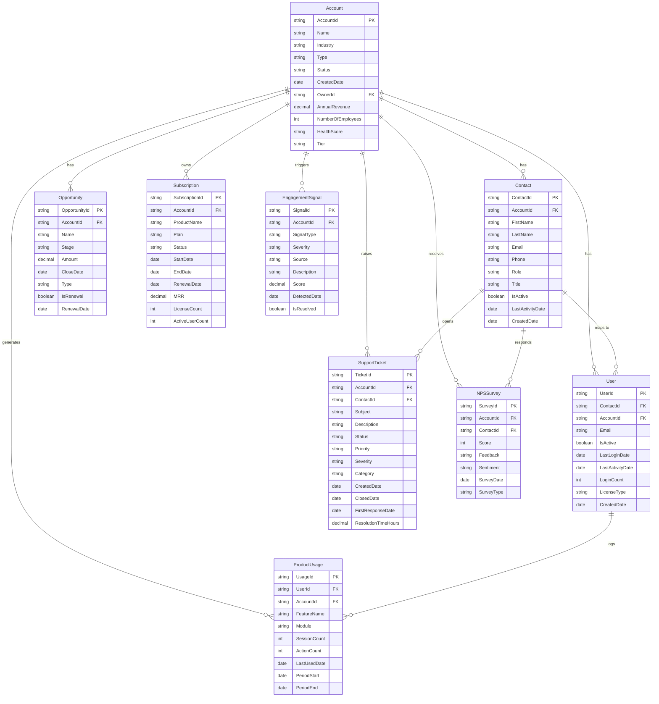

# Engagement Signals - CRM Schema ERD

## Entity Relationship Diagram

## Signal Derivation Logic

| Signal | Source Table | Key Fields | Logic |
|--------|-------------|------------|-------|
| Support ticket volume (high = dissatisfaction) | `SupportTicket` | `CreatedDate`, `Status`, `Severity` | Count tickets where `CreatedDate` > NOW - 90 days, grouped by `AccountId` |
| Last login / activity date | `User` | `LastLoginDate`, `IsActive` | Flag accounts where MAX(`LastLoginDate`) > X days ago |
| NPS score | `NPSSurvey` | `Score`, `SurveyDate` | Latest `Score` per account: 0-6 = Detractor, 7-8 = Passive, 9-10 = Promoter |
| Active user count from org | `User` | `IsActive`, `LastLoginDate`, `AccountId` | Count users where `IsActive = true` AND `LastLoginDate` within 30 days |
| Product adoption depth | `ProductUsage` | `SessionCount`, `FeatureName`, `Module` | Low/declining usage across features = churn risk |
| Renewal risk | `Subscription` | `RenewalDate`, `Status`, `MRR` | Combine with other negative signals near renewal window |

## EngagementSignal Types

| SignalType | Severity | Example |
|------------|----------|---------|
| `HIGH_TICKET_VOLUME` | High | >10 tickets in 90 days |
| `USER_INACTIVITY` | Medium | No login in 30+ days |
| `NPS_DETRACTOR` | High | NPS score 0-6 |
| `LOW_ADOPTION` | Medium | <20% feature usage |
| `DECLINING_USAGE` | Medium | 30%+ drop in sessions month-over-month |
| `RENEWAL_AT_RISK` | Critical | Renewal within 90 days + negative signals |
| `CHAMPION_DEPARTURE` | High | Key contact marked inactive |
| `LICENSE_UNDERUTILIZATION` | Low | ActiveUserCount < 50% of LicenseCount |
