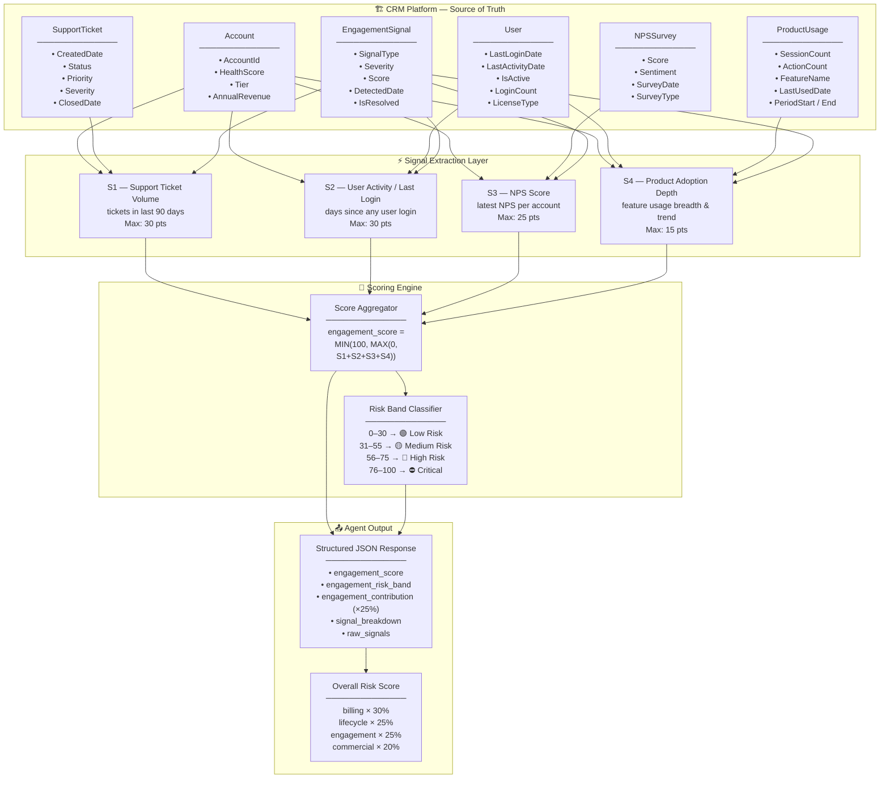
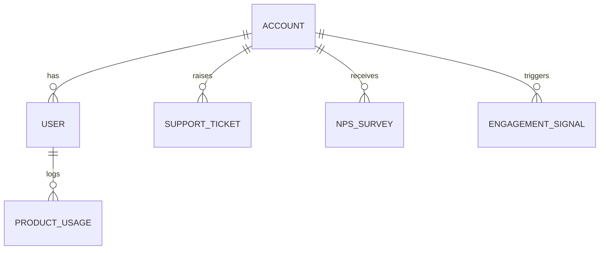
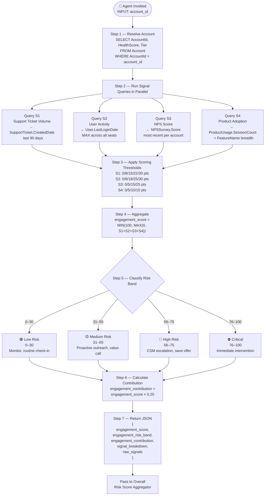
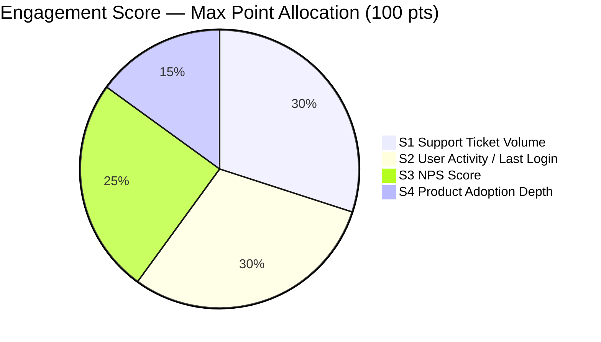
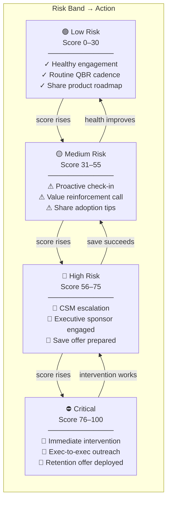

# Engagement Signals — Technical Architecture
## Agent Reference Document for Renewal Risk Scoring

---

## 1. Purpose

This document defines the **Engagement Signals** component of the Renewal Risk Scoring model.
An AI Agent must read this document together with `engagement-signals-erd.md` (which defines the CRM schema) to:
1. Understand which CRM objects to query
2. Extract the correct engagement fields
3. Compute sub-scores per signal
4. Aggregate into a final `engagement_score` (0–100)
5. Map the score to a risk band and recommended action

The `engagement_score` contributes **25%** of the overall Renewal Risk Score.

```
Overall Risk Score =
    (billing_health_score         × 30%) +
    (subscription_lifecycle_score × 25%) +
    (engagement_score             × 25%) +
    (commercial_fit_score         × 20%)
```

---

## 2. Platform Object Hierarchy

The Agent must query the following CRM objects (full schema defined in `engagement-signals-erd.md`):

```
Account                          (Level 1 — customer identity)
    ├── User                     (Level 2 — product login activity per seat)
    ├── SupportTicket            (Level 2 — support interactions per account)
    ├── NPSSurvey                (Level 2 — satisfaction scores per account)
    ├── ProductUsage             (Level 2 — feature-level usage logs per user)
    └── EngagementSignal         (Level 2 — pre-derived engagement signals)
```

---

## 2a. Architectural View

### 2a.1 — End-to-End System Architecture



---

### 2a.2 — Platform Object Relationship Map

See `engagement-signals-erd.md` for the full ERD. The key relationships used for scoring are:



---

### 2a.3 — Agent Execution Flow



---

### 2a.4 — Signal Contribution Breakdown (Visual Weight)



---

### 2a.5 — Risk Escalation Matrix



---

## 3. The Four Engagement Signals

### Signal 1 — Support Ticket Volume (Last 90 Days)
**Source:** `SupportTicket.CreatedDate`, `SupportTicket.Priority`, `SupportTicket.Severity`
**Description:** High support ticket volume — especially high-severity tickets — is a strong indicator of product frustration and churn risk.

| Threshold | Points Assigned |
|---|---|
| 0–2 tickets in 90 days | 0 |
| 3–5 tickets in 90 days | 8 |
| 6–9 tickets in 90 days | 15 |
| 10–14 tickets in 90 days | 22 |
| 15+ tickets in 90 days | 30 (capped) |

**Severity Modifier:** If any open ticket has `Priority = 'Critical'` or `Severity = 'P1'`, add +5 bonus points (applied before cap).

**Max contribution:** 30 points
**Query:**
```sql
SELECT
    COUNT(*) FILTER (
        WHERE CreatedDate >= NOW() - INTERVAL '90 days'
    ) AS ticket_volume_90d,
    COUNT(*) FILTER (
        WHERE CreatedDate >= NOW() - INTERVAL '90 days'
        AND Status != 'Closed'
        AND (Priority = 'Critical' OR Severity = 'P1')
    ) AS open_critical_tickets
FROM SupportTicket
WHERE AccountId = :account_id;
```

---

### Signal 2 — User Activity / Last Login
**Source:** `User.LastLoginDate`, `User.IsActive`, `User.LastActivityDate`
**Description:** Days since the most recent login across all active seats. No recent logins is one of the strongest predictors of churn. An account where users have stopped logging in is effectively dark.

| Threshold | Points Assigned |
|---|---|
| Login within last 7 days | 0 |
| Login 8–14 days ago | 8 |
| Login 15–30 days ago | 18 |
| Login 31–60 days ago | 25 |
| No login in 60+ days (or no active users) | 30 (capped) |

**Max contribution:** 30 points
**Query:**
```sql
SELECT
    MAX(LastLoginDate) AS most_recent_login,
    EXTRACT(DAY FROM NOW() - MAX(LastLoginDate))::INTEGER AS days_since_last_login,
    COUNT(*) FILTER (WHERE IsActive = true) AS active_user_count,
    COUNT(*) FILTER (
        WHERE IsActive = true
        AND LastLoginDate >= NOW() - INTERVAL '30 days'
    ) AS active_users_last_30d
FROM "User"
WHERE AccountId = :account_id;
```

---

### Signal 3 — NPS Score
**Source:** `NPSSurvey.Score`, `NPSSurvey.SurveyDate`, `NPSSurvey.Sentiment`
**Description:** The most recent NPS score per account is a direct measure of customer satisfaction. Detractors (0–6) are at high churn risk. Missing NPS data is also a moderate risk signal.

| Threshold | Points Assigned |
|---|---|
| Promoter: NPS 9–10 | 0 |
| Passive: NPS 7–8 | 5 |
| Detractor: NPS 0–6 | 15 |
| Extreme Detractor: NPS 0–4 | 25 (replaces 15) |
| No NPS data available | 10 (unknown = moderate risk) |

**Max contribution:** 25 points
**Query:**
```sql
SELECT
    Score AS nps_score,
    Sentiment AS nps_sentiment,
    SurveyDate AS survey_date
FROM NPSSurvey
WHERE AccountId = :account_id
  AND SurveyDate IS NOT NULL
ORDER BY SurveyDate DESC
LIMIT 1;
```

---

### Signal 4 — Product Adoption Depth
**Source:** `ProductUsage.SessionCount`, `ProductUsage.FeatureName`, `ProductUsage.Module`, `ProductUsage.ActionCount`
**Description:** Breadth and depth of feature adoption. Accounts using only one or two features are less embedded and easier to churn. A month-over-month decline in session count is an early warning sign.

| Threshold | Points Assigned |
|---|---|
| 5+ distinct modules used in last 30 days, stable or growing usage | 0 |
| 3–4 distinct modules used, stable usage | 5 |
| 1–2 distinct modules used, or usage declining > 20% MoM | 10 |
| No product usage recorded in last 30 days | 15 (capped) |

**Max contribution:** 15 points
**Query:**
```sql
-- Current month adoption
SELECT
    COUNT(DISTINCT Module) AS distinct_modules_30d,
    SUM(SessionCount) AS total_sessions_30d,
    SUM(ActionCount) AS total_actions_30d
FROM ProductUsage
WHERE AccountId = :account_id
  AND PeriodStart >= NOW() - INTERVAL '30 days';

-- Prior month for trend
SELECT
    SUM(SessionCount) AS total_sessions_prior_30d
FROM ProductUsage
WHERE AccountId = :account_id
  AND PeriodStart >= NOW() - INTERVAL '60 days'
  AND PeriodEnd < NOW() - INTERVAL '30 days';
```

**MoM Decline Calculation:**
```
decline_pct = (total_sessions_prior_30d - total_sessions_30d) / NULLIF(total_sessions_prior_30d, 0) * 100
```

---

## 4. Score Formula

```
engagement_score =
    MIN(100, MAX(0,
        support_ticket_points +
        user_activity_points +
        nps_score_points +
        product_adoption_points
    ))
```

**Contribution to overall score:**
```
engagement_contribution = engagement_score × 0.25
```

---

## 5. Structured JSON Output

The Agent must return the following JSON structure for the engagement component:

```json
{
  "engagement_score": 62,
  "engagement_risk_band": "High Risk",
  "engagement_contribution": 15.5,
  "signal_breakdown": {
    "S1_support_ticket_volume": {
      "points": 22,
      "raw": {
        "ticket_volume_90d": 12,
        "open_critical_tickets": 1
      }
    },
    "S2_user_activity": {
      "points": 18,
      "raw": {
        "days_since_last_login": 22,
        "active_user_count": 8,
        "active_users_last_30d": 3
      }
    },
    "S3_nps_score": {
      "points": 15,
      "raw": {
        "nps_score": 5,
        "nps_sentiment": "Detractor",
        "survey_date": "2026-04-10"
      }
    },
    "S4_product_adoption": {
      "points": 7,
      "raw": {
        "distinct_modules_30d": 2,
        "total_sessions_30d": 45,
        "total_sessions_prior_30d": 80,
        "decline_pct": 43.75
      }
    }
  },
  "raw_signals": {
    "account_id": "ACC-00123",
    "health_score": "At Risk",
    "tier": "Enterprise"
  }
}
```

---

## 6. Special Cases & Edge Handling

| Condition | Handling |
|---|---|
| Account has no `User` records | Set `user_activity_points = 30` (maximum risk — no known users) |
| `NPSSurvey` table has no rows for account | Set `nps_score_points = 10` (unknown = moderate risk) |
| `ProductUsage` has no rows in last 60 days | Set `product_adoption_points = 15` (maximum adoption risk) |
| NPS survey older than 12 months | Treat as no data — set `nps_score_points = 10` |
| Active user count = 0 | Set `user_activity_points = 30` regardless of login timestamps |
| `EngagementSignal` table has an unresolved `CHAMPION_DEPARTURE` signal | Add +5 bonus to final `engagement_score` before capping at 100 |
