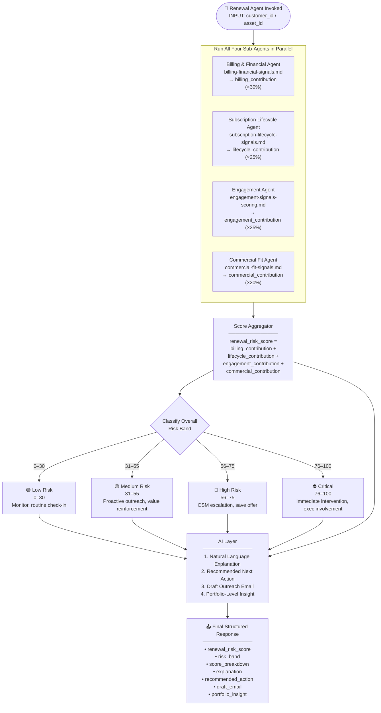
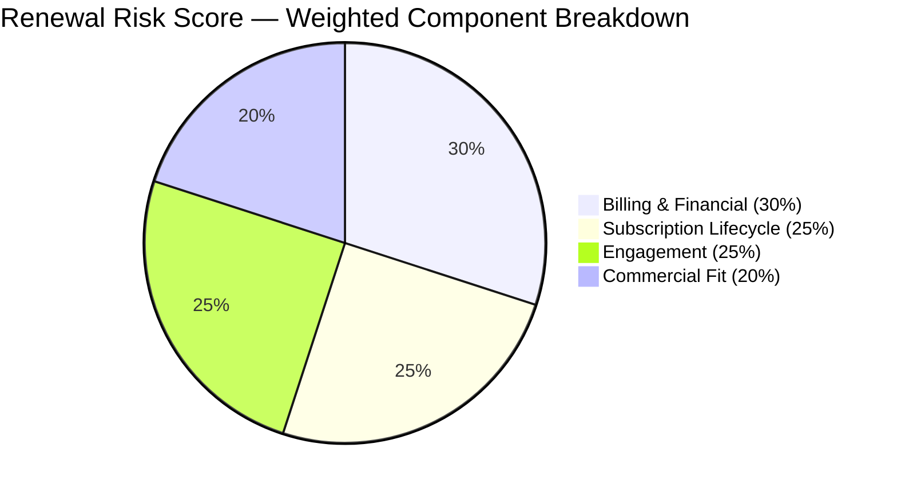
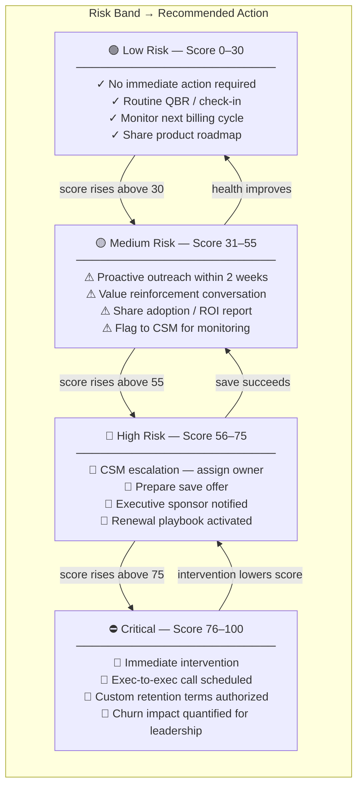

# Renewal Risk Score Aggregator & AI Layer
## Agent Reference Document for Renewal Risk Scoring

---

## 1. Purpose

This document defines the **master orchestration layer** of the Renewal Risk Scoring model.
The Agent must:
1. Collect the four weighted sub-scores from the component agents
2. Compute the final `renewal_risk_score` (0–100)
3. Classify the overall Risk Band
4. Invoke the AI Layer to produce natural language outputs
5. Return a single structured response with scores, explanations, recommended actions, and a draft outreach email

**⚠️ DATA SOURCE RULE — MUST FOLLOW:**
All output values (asset IDs, account names, ARR, renewal dates, due amounts, scores) must be read from the actual files in the `Data/` folder:
- `Data/assets_grid.csv` — asset identity, ARR, expiry, due amounts
- `Data/customers.csv` — account name and ID
- `Data/subscriptions.csv` — renewal date, contract type, license counts
- `Data/invoices.csv` — overdue amounts and days past due
- `Data/payment_attempts.csv` — payment failure history
- `Data/billing_disputes.csv` — disputes and chargebacks
- `Data/asset_transaction_history.csv` — upgrades/downgrades
- `Data/renewals.csv` — renewal history and behavior
- `Data/support_tickets.csv` — ticket volume and severity
- `Data/users.csv` — login activity
- `Data/nps_surveys.csv` — NPS scores
- `Data/product_usage.csv` — feature adoption

Never use the example values shown in Section 5. Section 5 is a schema template only.

**This document is read AFTER all four component documents have been processed:**
- `billing-financial-signals.md` → `billing_contribution` (30%)
- `subscription-lifecycle-signals.md` → `lifecycle_contribution` (25%)
- `engagement-signals-scoring.md` → `engagement_contribution` (25%)
- `commercial-fit-signals.md` → `commercial_contribution` (20%)

---

## 2. Overall Score Formula

```
renewal_risk_score =
    billing_health_score         × 0.30  +
    subscription_lifecycle_score × 0.25  +
    engagement_score             × 0.25  +
    commercial_fit_score         × 0.20
```

All four sub-scores are on a 0–100 scale. The resulting `renewal_risk_score` is also 0–100.

**Higher score = higher churn risk.**

---

## 2a. System Architecture

### 2a.1 — Master Orchestration Flow



---

### 2a.2 — Score Composition Visual



---

### 2a.3 — Risk Band to Action Matrix



---

## 3. Risk Band Definitions

| Score | Band | Color | Recommended Cadence | Escalation |
|---|---|---|---|---|
| 0–30 | Low Risk | 🟢 Green | Monthly automated check-in | None |
| 31–55 | Medium Risk | 🟡 Yellow | Bi-weekly CSM outreach | CSM awareness |
| 56–75 | High Risk | 🔴 Red | Weekly CSM + AE alignment | CSM + AE assigned |
| 76–100 | Critical | ⛔ Dark Red | Daily exec tracking | CSM + AE + Exec sponsor |

---

## 4. The AI Layer

The AI Layer runs after the numeric score is computed. It produces four outputs per asset:

### 4.1 Natural Language Explanation

**Purpose:** Don't just show a number — explain WHY the asset is at risk in plain English.

**Rules:**
- Reference the top 2–3 highest-contributing signals by name
- Use specific data from the `raw_signals` fields (not generic language)
- Keep the explanation to 2–4 sentences
- Avoid jargon; write as if briefing a CSM who does not read spreadsheets

**Template:**
```
This asset scores {renewal_risk_score}/100 ({risk_band}).
The highest-risk signals are: {top_signal_1} ({points} pts) and {top_signal_2} ({points} pts).
{Specific data observation — e.g., "The last invoice was 45 days overdue and there were 3 payment failures in the past 90 days."}
{Context sentence — e.g., "This is a monthly contract that has not renewed in 14 months, which increases churn likelihood."}
```

**Example output:**
> "This asset scores 72/100 (High Risk). The dominant risk signals are billing health (overdue invoice 45 days, 3 payment failures in 90 days) and engagement decline (no user logins in 38 days, NPS score of 4). The account is on a monthly contract with no prior renewal history, and license utilization has dropped to 32%."

---

### 4.2 Recommended Next Action

**Purpose:** Give the CSM or renewal manager a single, specific, prioritized action to take — not a menu.

**Action Selection Logic (applied in order):**

| Condition | Recommended Action |
|---|---|
| `risk_band = Critical` AND billing signals dominate | "Initiate exec-to-exec call and prepare custom payment plan. Escalate to VP CS." |
| `risk_band = Critical` AND engagement signals dominate | "Schedule immediate product success review with champion. Offer dedicated CSM office hours." |
| `risk_band = High Risk` AND renewal within 30 days | "Activate save playbook immediately. Prepare renewal offer with right-size option." |
| `risk_band = High Risk` AND renewal > 30 days | "CSM to schedule value review call within 5 business days. Prepare ROI summary." |
| `risk_band = Medium Risk` AND NPS < 7 | "Send NPS follow-up email with specific action plan addressing stated pain points." |
| `risk_band = Medium Risk` AND low adoption | "Trigger product adoption email sequence. Offer CSM-led training session." |
| `risk_band = Low Risk` | "No immediate action. Add to monthly CSM review queue. Monitor next billing cycle." |

---

### 4.3 Draft Outreach Email

**Purpose:** One click → a personalized renewal email the CSM can review, edit, and send.

**Email generation rules:**
- Use the account name, CSM name (if available), and specific signal data
- Never mention the numeric risk score in the email
- Frame from a position of partnership, not alarm
- Include one specific reference to the customer's product/use case
- Include a clear, low-friction call to action (30-minute call, not a long form)
- Adjust tone by risk band:
  - Low / Medium: warm, value-forward
  - High: concerned, urgent but not alarming
  - Critical: executive-level, direct

**Draft Email Template:**
```
Subject: {Account Name} — Checking in ahead of your renewal

Hi {Contact First Name},

I wanted to reach out personally ahead of your renewal on {Renewal Date}.

{Value statement — e.g., "Our team has loved supporting [Account Name] and we want to make sure you're getting the most out of [Product]."}

{Specific observation — e.g., "I noticed usage has been lighter than usual over the past few weeks — I'd love to understand if there's anything we can do to help."}

Would you have 30 minutes for a quick call this week? I can share some ideas on how other {Industry/Tier} customers are getting value from {Feature Area}.

{Optional: "I've also asked our team to prepare a right-size option for your review."}

Best,
{CSM Name}
{Title}
{Email / Calendar Link}
```

---

### 4.4 Portfolio-Level Insight

**Purpose:** Give CS leadership a portfolio-wide view — not just one asset.

**Computed when the Agent is invoked in bulk mode (multiple assets):**

```
portfolio_insight = {
  "total_assets_analyzed": N,
  "assets_by_band": {
    "low_risk": count,
    "medium_risk": count,
    "high_risk": count,
    "critical": count
  },
  "arr_at_risk": {
    "high_risk_arr": sum of TotalARR where risk_band = High Risk,
    "critical_arr": sum of TotalARR where risk_band = Critical,
    "total_at_risk_arr": high_risk_arr + critical_arr
  },
  "estimated_retention": {
    "without_intervention_pct": historical_save_rate_without_action,
    "with_intervention_pct": historical_save_rate_with_action,
    "estimated_arr_saved": total_at_risk_arr × (with - without)
  },
  "top_risk_drivers": [
    "Billing overdue > 30 days (affects N assets)",
    "No user login in 30+ days (affects N assets)",
    "NPS Detractor score (affects N assets)"
  ],
  "renewal_calendar": [
    { "window": "Next 30 days", "count": N, "arr": sum },
    { "window": "31–60 days", "count": N, "arr": sum },
    { "window": "61–90 days", "count": N, "arr": sum }
  ]
}
```

**Example portfolio insight narrative:**
> "You have $127,000 of ARR at High or Critical risk renewing in the next 30 days across 14 assets. Based on historical save rates for similar profiles, you can expect to retain ~65% ($82,550) without intervention. With proactive outreach on all High/Critical assets, modeled retention rises to ~82% ($104,140) — a potential $21,590 improvement. The top shared risk driver is billing overdue > 30 days, affecting 9 of the 14 assets."

---

## 5. Final Structured JSON Output

**CRITICAL AGENT INSTRUCTION:** Every field in this JSON must be populated from **live data read from the actual CSV files** listed in the `Data/` folder. Do NOT return placeholder values, example values, or hardcoded data from this document. Treat the structure below as a schema — every value must be computed or looked up from the real data.

---

### 5a. Data Model — Entity Join Keys

The agent must understand the following join relationships before resolving any field. These are the only valid paths between files:

```
assets_grid.Id
    │
    │  1:1  (same ALI-xxx key)
    ▼
asset_line_items.asset_line_item_id
    │
    ├──► account_id  ──────────────────────────────────► customers.customer_id
    │                                                         │
    │                                                    customers.name (account_name)
    │
    │  asset_line_items.subscription_id  →  subscriptions.subscription_id  (explicit FK)
    ▼
subscriptions.subscription_id
    │
    ├──► customer_id         (confirms account link)
    ├──► contract_type       (monthly / annual / multi_year)
    ├──► activated_at        (subscription age for lifecycle scoring)
    ├──► renewal_date        (days-to-renewal, renewal proximity)
    ├──► license_count       (denominator for utilization)
    └──► active_user_count   (numerator for utilization)
    │
    ▼
renewals.subscription_id  (1:many — one row per renewal event)
    └──► renewal_status, days_late, negotiation_flag

asset_transaction_history.subscription_id  (1:many — one row per upgrade/downgrade)
    └──► action, change_in_asset_arr, transaction_date
    NOTE: asset_transaction_history has NO asset_line_item_id.
          Join via asset_line_items.subscription_id → asset_transaction_history.subscription_id.
```

**Account-level signal files** (all rows are for CUST-001 — no per-asset filter needed):

| File | Join Key | What it provides |
|---|---|---|
| `invoices.csv` | `customer_id = CUST-001` | Overdue days, unpaid amounts per invoice |
| `payment_attempts.csv` | `customer_id = CUST-001` | Failed payment count, failure reasons |
| `billing_disputes.csv` | `customer_id = CUST-001` | Disputes and chargebacks |
| `support_tickets.csv` | `account_id = CUST-001` | Ticket volume and severity |
| `users.csv` | `account_id = CUST-001` | Last login date across all seats |
| `nps_surveys.csv` | `account_id = CUST-001` | Most recent NPS score |
| `product_usage.csv` | `account_id = CUST-001` | Feature adoption depth and session counts |

**To scope billing/payment signals to a specific asset**, join `asset_line_items.subscription_id` → `invoices.subscription_id`, then join `payment_attempts` and `billing_disputes` via `invoice_id`.

---

### 5b. Field-to-Data-Source Mapping

| JSON Field | Source File | Source Column / Derivation |
|---|---|---|
| `asset_id` | `Data/assets_grid.csv` | `Id` |
| `asset_name` | `Data/assets_grid.csv` | `Asset Name` |
| `account_id` | `Data/customers.csv` | `customer_id` (join via `asset_line_items.account_id`) |
| `account_name` | `Data/customers.csv` | `name` |
| `arr` | `Data/assets_grid.csv` | `ARR` |
| `renewal_date` | `Data/subscriptions.csv` | `renewal_date` (matched by asset via `asset_line_items.csv`) |
| `expires_in_days` | `Data/assets_grid.csv` | `Expires In Days` |
| `due_amount` | `Data/assets_grid.csv` | `Due Amount` |
| `renewal_amount` | `Data/assets_grid.csv` | `Renewal Amount` |
| `upsell_opportunity_amount` | `Data/assets_grid.csv` | `Upsell Opportunity Amount` |
| `billing_health_score` | Computed | Apply scoring rules from `billing-financial-signals.md` against `invoices.csv`, `payment_attempts.csv`, `billing_disputes.csv`, `asset_transaction_history.csv` |
| `subscription_lifecycle_score` | Computed | Apply scoring rules from `subscription-lifecycle-signals.md` against `subscriptions.csv`, `renewals.csv` |
| `engagement_score` | Computed | Apply scoring rules from `engagement-signals-scoring.md` against `support_tickets.csv`, `users.csv`, `nps_surveys.csv`, `product_usage.csv` |
| `commercial_fit_score` | Computed | Apply scoring rules from `commercial-fit-signals.md` against `subscriptions.csv`, `asset_line_items.csv`, `asset_transaction_history.csv` |
| `renewal_risk_score` | Computed | `(billing × 0.30) + (lifecycle × 0.25) + (engagement × 0.25) + (commercial × 0.20)` |
| `risk_band` | Computed | Classify from `renewal_risk_score`: 0–30 Low, 31–55 Medium, 56–75 High, 76–100 Critical |
| `top_risk_signals` | Computed | Ranked list of highest-scoring individual signals from all four components, with actual values cited |
| `explanation` | AI Layer | 2–4 sentences referencing actual signal values read from the data files |
| `recommended_action` | AI Layer | Apply action selection logic from Section 4.2 using actual `risk_band` and dominant signal |
| `draft_email.subject` | AI Layer | Use actual `account_name` from `customers.csv` and actual `renewal_date` from `subscriptions.csv` |
| `draft_email.body` | AI Layer | Cite actual overdue days, NPS score, payment failure count, and expiry date from data |

### Output Schema

The agent must produce JSON in exactly this structure, with all values replaced by actual computed or looked-up data:

```json
{
  "asset_id": "<Id from assets_grid.csv>",
  "asset_name": "<Asset Name from assets_grid.csv>",
  "account_id": "<customer_id from customers.csv>",
  "account_name": "<name from customers.csv>",
  "arr": "<ARR from assets_grid.csv — numeric>",
  "renewal_date": "<renewal_date from subscriptions.csv>",
  "expires_in_days": "<Expires In Days from assets_grid.csv>",
  "due_amount": "<Due Amount from assets_grid.csv — numeric>",
  "renewal_amount": "<Renewal Amount from assets_grid.csv — numeric>",
  "upsell_opportunity_amount": "<Upsell Opportunity Amount from assets_grid.csv — numeric>",

  "renewal_risk_score": "<computed 0–100>",
  "risk_band": "<Low Risk | Medium Risk | High Risk | Critical>",

  "score_breakdown": {
    "billing_health_score": "<computed 0–100>",
    "billing_contribution": "<billing_health_score × 0.30>",
    "subscription_lifecycle_score": "<computed 0–100>",
    "lifecycle_contribution": "<subscription_lifecycle_score × 0.25>",
    "engagement_score": "<computed 0–100>",
    "engagement_contribution": "<engagement_score × 0.25>",
    "commercial_fit_score": "<computed 0–100>",
    "commercial_contribution": "<commercial_fit_score × 0.20>"
  },

  "top_risk_signals": [
    { "signal": "<actual signal description with real data value>", "component": "<billing|lifecycle|engagement|commercial>", "points": "<actual points scored>" }
  ],

  "mitigating_signals": [
    { "signal": "<actual positive signal with real data value>", "component": "<component name>" }
  ],

  "ai_layer": {
    "explanation": "<2–4 sentences citing actual values: overdue days, NPS score, payment failures, login days, utilization % — all from real data>",
    "recommended_action": "<single specific action based on actual risk_band and dominant signal — cite actual renewal date and ARR from data>",
    "draft_email": {
      "subject": "<actual account_name + actual renewal date>",
      "body": "<full email body citing actual signal data — never mention the numeric risk score>"
    }
  },

  "weight_config": {
    "billing": 0.30,
    "lifecycle": 0.25,
    "engagement": 0.25,
    "commercial": 0.20,
    "is_default": true
  }
}
```

---

## 6. Configurable Score Weights

The four component weights are configurable. The default configuration is:

| Component | Default Weight | Min | Max |
|---|---|---|---|
| `billing_health_score` | 30% | 10% | 50% |
| `subscription_lifecycle_score` | 25% | 10% | 40% |
| `engagement_score` | 25% | 10% | 40% |
| `commercial_fit_score` | 20% | 10% | 40% |

**Constraint:** All four weights must sum to exactly 100%.

If a user or admin modifies the weights, the Agent must:
1. Validate that the four weights sum to 100
2. Re-compute `renewal_risk_score` using the updated weights
3. Note the weight configuration used in the response JSON under `"weight_config"`

**Default weight configuration object:**
```json
{
  "weight_config": {
    "billing": 0.30,
    "lifecycle": 0.25,
    "engagement": 0.25,
    "commercial": 0.20,
    "is_default": true
  }
}
```

---

## 7. Assets Grid — Column Derivation

The file `Data/assets_grid.csv` powers the portfolio renewal grid UI. All columns except `risk_band` and `recommended_actions_count` are sourced directly from the platform data. Those two columns are populated exclusively by this agent after scoring is complete.

### Column Sources

| Grid Column | Source | Derivation |
|---|---|---|
| `asset_id` | `Data/asset_line_items.csv` | `asset_line_item_id` |
| `asset_name` | `Data/asset_line_items.csv` | Display label |
| `company` | `Data/customers.csv` | `name` |
| `price_monthly` | `Data/subscriptions.csv` | `total_arr / 12` (MRR) |
| `term_months` | `Data/asset_line_items.csv` | `selling_term` |
| `expires_in_days` | `Data/subscriptions.csv` | `DATEDIFF(renewal_date, CURRENT_DATE)` |
| `expires_date` | `Data/subscriptions.csv` | `renewal_date` |
| `due_amount` | `Data/invoices.csv` | `total_amount` WHERE `due_past_by > 0` AND `paid_at IS NULL`; else `0` |
| `base_tcv` | `Data/asset_line_items.csv` | `tcv` |
| `grr_pct` | `Data/asset_transaction_history.csv` | `(original_arr - downgrade_arr_loss) / original_arr × 100` |
| `nrr_pct` | `Data/asset_transaction_history.csv` | `(original_arr - downgrade_arr_loss + upgrade_arr_gain) / original_arr × 100` |
| `renewal_amount` | Computed | `current_arr × (nrr_pct / 100)` — estimated renewal value |
| `upsell_opp_amount` | Computed | Based on license headroom and usage growth trend |
| `risk_band` | **⚡ RENEWAL RISK AGENT** | Output of `renewal_risk_score` → Risk Band classification |
| `recommended_actions_count` | **⚡ RENEWAL RISK AGENT** | Count of distinct recommended actions from AI Layer |

### GRR / NRR Computation Queries

```sql
-- GRR: gross retention (downgrades only, no expansions, capped at 100%)
SELECT
    account_id,
    ROUND(
        LEAST(100,
            (current_arr / NULLIF(current_arr - net_downgrade_arr, 0)) * 100
        ), 1
    ) AS grr_pct
FROM (
    SELECT
        customer_id AS account_id,
        SUM(change_in_asset_arr) FILTER (WHERE action = 'Downgrade') AS net_downgrade_arr,
        MAX(arr) AS current_arr
    FROM asset_transaction_history
    JOIN asset_line_items USING (subscription_id)
    WHERE transaction_date >= NOW() - INTERVAL '12 months'
    GROUP BY customer_id
) t;

-- NRR: net retention (downgrades + upgrades)
SELECT
    account_id,
    ROUND(
        ((current_arr + upgrade_arr - ABS(downgrade_arr)) /
         NULLIF(current_arr - upgrade_arr + ABS(downgrade_arr), 0)) * 100
    , 1) AS nrr_pct
FROM (
    SELECT
        customer_id AS account_id,
        SUM(change_in_asset_arr) FILTER (WHERE action = 'Upgrade') AS upgrade_arr,
        SUM(change_in_asset_arr) FILTER (WHERE action = 'Downgrade') AS downgrade_arr,
        MAX(arr) AS current_arr
    FROM asset_transaction_history
    JOIN asset_line_items USING (subscription_id)
    WHERE transaction_date >= NOW() - INTERVAL '12 months'
    GROUP BY customer_id
) t;
```

### Agent Write-Back

After scoring each asset, the agent writes the two derived columns back to `assets_grid.csv`:

```
risk_band              → "Low Risk" | "Medium Risk" | "High Risk" | "Critical"
recommended_actions_count → integer (1, 2, or 3 based on risk band and signal severity)
```

The `recommended_actions_count` maps to the number of action icons shown in the UI:
- 1 action → Low / Medium Risk (monitor or standard outreach)
- 2 actions → High Risk (CSM outreach + save offer)
- 3 actions → Critical (exec call + custom terms + immediate CSM escalation)
