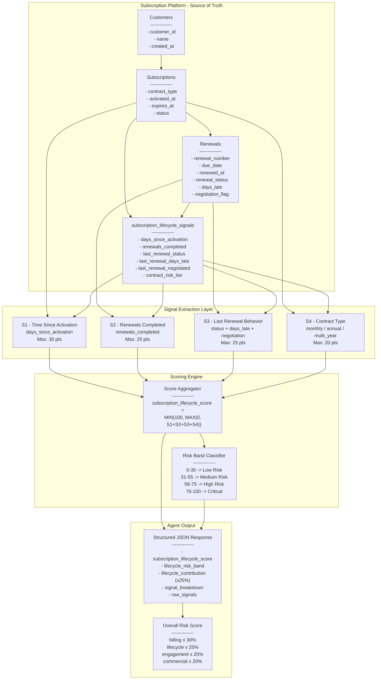
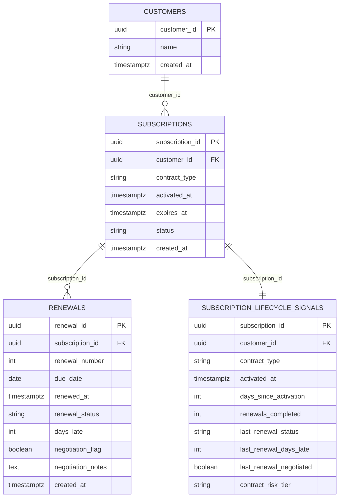
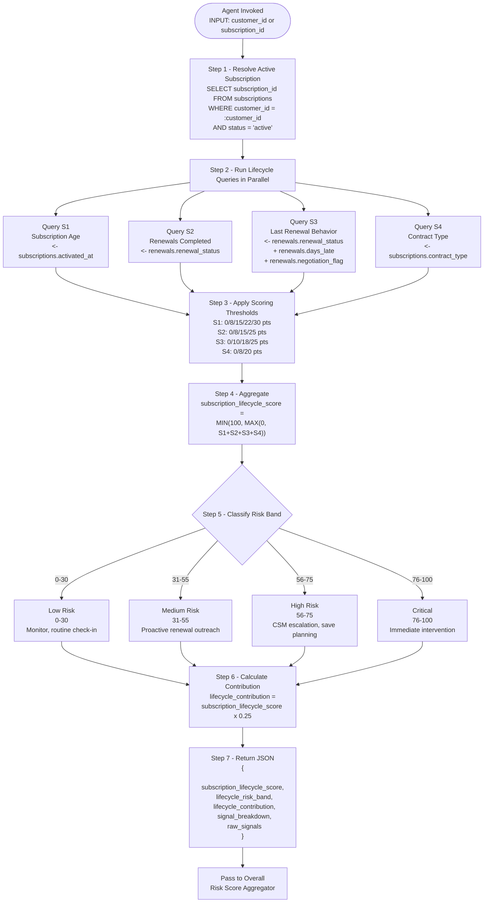
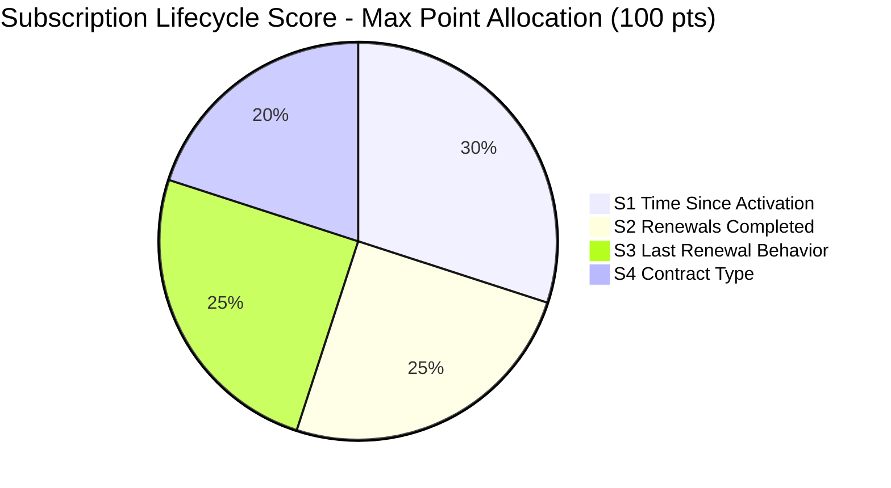
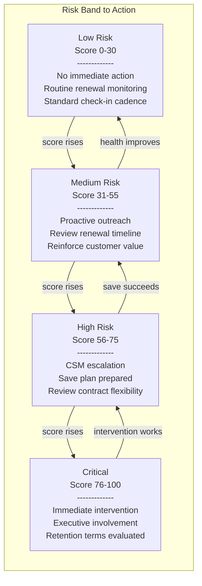

# Subscription Lifecycle Signals - Technical Architecture
## Agent Reference Document for Renewal Risk Scoring

---

## 1. Purpose

This document defines the **Subscription Lifecycle Signals** component of the Renewal Risk Scoring model.
An AI Agent must read this document to:
1. Understand which lifecycle objects to query
2. Extract the correct subscription and renewal fields
3. Compute sub-scores per lifecycle signal
4. Aggregate into a final `subscription_lifecycle_score` (0-100)
5. Map the score to a risk band and recommended action

The `subscription_lifecycle_score` contributes **25%** of the overall Renewal Risk Score.

```
Overall Risk Score =
    (billing_health_score         x 30%) +
    (subscription_lifecycle_score x 25%) +
    (engagement_score             x 25%) +
    (commercial_fit_score         x 20%)
```

---

## 2. Platform Object Hierarchy

The Agent must traverse the following lifecycle object hierarchy:

```
customers                         (Level 1 - customer identity anchor)
    \-- subscriptions             (Level 2 - active subscription contract)
            \-- renewals          (Level 3 - one record per renewal event)
```

### Supporting Object

```
subscription_lifecycle_signals    (Materialized view - pre-joined lifecycle scoring inputs)
```

---

## 2a. Architectural View

### 2a.1 - End-to-End System Architecture



---

### 2a.2 - Platform Object Relationship Map



---

### 2a.3 - Agent Execution Flow



---

### 2a.4 - Signal Contribution Breakdown (Visual Weight)



---

### 2a.5 - Risk Escalation Matrix



---

## 3. Platform Object Definitions

### 3.1 customers
**Purpose:** Root identity record for the customer account.
**Platform Name:** `customers`
**Relationship:** One customer can own many subscriptions.

| Field | Data Type | Description | Churn Signal |
|---|---|---|---|
| `customer_id` | UUID | Primary key | Join key |
| `name` | VARCHAR(255) | Customer name | Customer context |
| `created_at` | TIMESTAMPTZ | Customer record creation timestamp | Tenure context |

---

### 3.2 subscriptions
**Purpose:** Active commercial subscription record for a customer.
**Platform Name:** `subscriptions`
**Relationship:** Many subscriptions -> One customer

| Field | Data Type | Description | Churn Signal |
|---|---|---|---|
| `subscription_id` | UUID | Primary key | Join key |
| `customer_id` | UUID | Customer FK | Parent link |
| `contract_type` | VARCHAR(20) | `monthly`, `annual`, `multi_year` | **Commitment strength** |
| `activated_at` | TIMESTAMPTZ | Subscription activation timestamp | **Lifecycle maturity** |
| `expires_at` | TIMESTAMPTZ | Subscription end timestamp | Renewal timing |
| `status` | VARCHAR(20) | `active`, `churned`, `paused`, `pending` | Filter to active lifecycle |
| `created_at` | TIMESTAMPTZ | Row creation timestamp | Audit trail |

---

### 3.3 renewals
**Purpose:** Historical record of each renewal event per subscription.
**Platform Name:** `renewals`
**Relationship:** Many renewals -> One subscription

| Field | Data Type | Description | Churn Signal |
|---|---|---|---|
| `renewal_id` | UUID | Primary key | Join key |
| `subscription_id` | UUID | Subscription FK | Parent link |
| `renewal_number` | INTEGER | Ordinal renewal count | **Loyalty depth** |
| `due_date` | DATE | Planned renewal date | Timing baseline |
| `renewed_at` | TIMESTAMPTZ | Actual renewal completion timestamp | Delay measurement |
| `renewal_status` | VARCHAR(20) | `on_time`, `late`, `negotiated`, `churned`, `pending` | **Renewal quality** |
| `days_late` | INTEGER | Generated renewal delay in days | **Friction signal** |
| `negotiation_flag` | BOOLEAN | Whether renewal required negotiation | **Commercial stress** |
| `negotiation_notes` | TEXT | Notes captured during negotiation | Qualitative context |
| `created_at` | TIMESTAMPTZ | Row creation timestamp | Audit trail |

---

### 3.4 subscription_lifecycle_signals
**Purpose:** Materialized scoring view joining the four lifecycle signals into one consumable surface.
**Platform Name:** `subscription_lifecycle_signals`
**Relationship:** One materialized row per active subscription

| Field | Data Type | Description | Churn Signal |
|---|---|---|---|
| `subscription_id` | UUID | Subscription PK | Join key |
| `customer_id` | UUID | Customer FK | Customer link |
| `contract_type` | VARCHAR(20) | Subscription contract type | Commitment class |
| `activated_at` | TIMESTAMPTZ | Original activation timestamp | Age baseline |
| `days_since_activation` | INTEGER | Days since activation | **Signal 1** |
| `renewals_completed` | INTEGER | Number of completed renewals | **Signal 2** |
| `last_renewal_status` | VARCHAR(20) | Most recent renewal outcome | **Signal 3** |
| `last_renewal_days_late` | INTEGER | Delay on most recent renewal | **Signal 3 detail** |
| `last_renewal_negotiated` | BOOLEAN | Whether last renewal was negotiated | **Signal 3 detail** |
| `contract_risk_tier` | VARCHAR(20) | Derived risk tier from contract type | **Signal 4** |

---

## 4. The Four Subscription Lifecycle Signals

### Signal 1 - Time Since Activation
**Source:** `subscriptions.activated_at`, `subscription_lifecycle_signals.days_since_activation`
**Description:** Newer subscriptions churn differently than mature subscriptions with multiple years of history.

| Threshold | Points Assigned |
|---|---|
| 3+ years active | 0 |
| 1-3 years active | 8 |
| 6-12 months active | 15 |
| 3-6 months active | 22 |
| < 3 months active | 30 |

**Max contribution:** 30 points
**Query:**
```sql
SELECT EXTRACT(DAY FROM now() - activated_at)::INTEGER AS days_since_activation
FROM subscriptions
WHERE subscription_id = :subscription_id
  AND status = 'active';
```

---

### Signal 2 - Number of Renewals Already Completed
**Source:** `renewals.renewal_status`, `renewals.renewal_number`, `subscription_lifecycle_signals.renewals_completed`
**Description:** Customers who have successfully renewed multiple times are typically lower churn risk than first-cycle subscriptions.

| Threshold | Points Assigned |
|---|---|
| 3+ completed renewals | 0 |
| 2 completed renewals | 8 |
| 1 completed renewal | 15 |
| 0 completed renewals | 25 |

**Max contribution:** 25 points
**Query:**
```sql
SELECT COUNT(*) FILTER (WHERE renewal_status != 'pending') AS renewals_completed
FROM renewals
WHERE subscription_id = :subscription_id;
```

---

### Signal 3 - Last Renewal Behavior
**Source:** `renewals.renewal_status`, `renewals.days_late`, `renewals.negotiation_flag`
**Description:** The last renewal is a strong proxy for current retention friction: on-time is healthy, late renewals indicate drag, and negotiated renewals indicate stress.

| Threshold | Points Assigned |
|---|---|
| Last renewal was `on_time` | 0 |
| Last renewal was `late` and `days_late` <= 15 | 10 |
| Last renewal was `late` and `days_late` > 15 | 18 |
| Last renewal was `negotiated` or `negotiation_flag = true` | 25 |

**Max contribution:** 25 points
**Query:**
```sql
SELECT renewal_status, days_late, negotiation_flag
FROM renewals
WHERE subscription_id = :subscription_id
  AND renewal_status != 'pending'
ORDER BY renewal_number DESC
LIMIT 1;
```

---

### Signal 4 - Contract Type
**Source:** `subscriptions.contract_type`, `subscription_lifecycle_signals.contract_risk_tier`
**Description:** Month-to-month subscriptions churn materially more often than annual or multi-year commitments.

| Threshold | Points Assigned |
|---|---|
| `multi_year` | 0 |
| `annual` | 8 |
| `monthly` | 20 |

**Max contribution:** 20 points
**Query:**
```sql
SELECT contract_type
FROM subscriptions
WHERE subscription_id = :subscription_id
  AND status = 'active';
```

---

## 5. Score Formula

```text
subscription_lifecycle_score =
    MIN(100, MAX(0,
        activation_age_points +
        renewals_completed_points +
        last_renewal_behavior_points +
        contract_type_points
    ))
```

---

## 6. Scoring Pseudocode

```python
def compute_subscription_lifecycle_score(subscription_id):
    activation_age_points = calculate_activation_age_points(subscription_id)
    renewals_completed_points = calculate_renewals_completed_points(subscription_id)
    last_renewal_behavior_points = calculate_last_renewal_behavior_points(subscription_id)
    contract_type_points = calculate_contract_type_points(subscription_id)

    total_score = (
        activation_age_points +
        renewals_completed_points +
        last_renewal_behavior_points +
        contract_type_points
    )

    return min(100, max(0, total_score))
```

---

## 7. Risk Band Mapping

| Score | Risk Band | Action |
|---|---|---|
| 0-30 | Low Risk | Routine monitoring and standard renewal motion |
| 31-55 | Medium Risk | Proactive outreach and value reinforcement |
| 56-75 | High Risk | CSM escalation and save strategy preparation |
| 76-100 | Critical | Immediate intervention and executive involvement |

---

## 8. Full SQL View

```sql
CREATE MATERIALIZED VIEW subscription_lifecycle_signals AS
SELECT
   s.subscription_id,
   s.customer_id,
   s.contract_type,
   s.activated_at,

   EXTRACT(DAY FROM now() - s.activated_at)::INTEGER AS days_since_activation,

   COUNT(r.renewal_id) FILTER (WHERE r.renewal_status != 'pending')
      AS renewals_completed,

   (SELECT renewal_status
    FROM renewals
    WHERE subscription_id = s.subscription_id
    ORDER BY renewal_number DESC
    LIMIT 1) AS last_renewal_status,

   (SELECT days_late
    FROM renewals
    WHERE subscription_id = s.subscription_id
    ORDER BY renewal_number DESC
    LIMIT 1) AS last_renewal_days_late,

   (SELECT negotiation_flag
    FROM renewals
    WHERE subscription_id = s.subscription_id
    ORDER BY renewal_number DESC
    LIMIT 1) AS last_renewal_negotiated,

   CASE s.contract_type
       WHEN 'monthly' THEN 'high'
       WHEN 'annual' THEN 'medium'
       WHEN 'multi_year' THEN 'low'
   END AS contract_risk_tier

FROM subscriptions s
LEFT JOIN renewals r ON r.subscription_id = s.subscription_id
WHERE s.status = 'active'
GROUP BY s.subscription_id, s.customer_id, s.contract_type, s.activated_at;
```

---

## 9. Agent Instructions

### Step-by-Step Execution Flow

```text
1. Resolve the active subscription_id
2. Query subscriptions and renewals directly, or use subscription_lifecycle_signals
3. Calculate the four lifecycle signal point values
4. Aggregate the values into subscription_lifecycle_score
5. Map the score to a lifecycle risk band
6. Calculate lifecycle_contribution = subscription_lifecycle_score x 0.25
7. Return structured JSON for the overall risk engine
```

Expected output:

```json
{
  "subscription_lifecycle_score": 58,
  "lifecycle_risk_band": "High Risk",
  "lifecycle_contribution": 14.5,
  "signal_breakdown": {
    "time_since_activation": 15,
    "renewals_completed": 15,
    "last_renewal_behavior": 18,
    "contract_type": 10
  },
  "raw_signals": {
    "days_since_activation": 284,
    "renewals_completed": 1,
    "last_renewal_status": "late",
    "last_renewal_days_late": 21,
    "last_renewal_negotiated": false,
    "contract_type": "annual"
  }
}
```

---

## 10. Final Summary

The Subscription Lifecycle Signals Engine evaluates:

- time since activation
- number of renewals already completed
- last renewal quality
- contract type commitment strength

to predict renewal stability and churn risk, using only the schema-backed lifecycle objects available in the platform. This component contributes 25% of the overall AI Renewal Risk Score.
